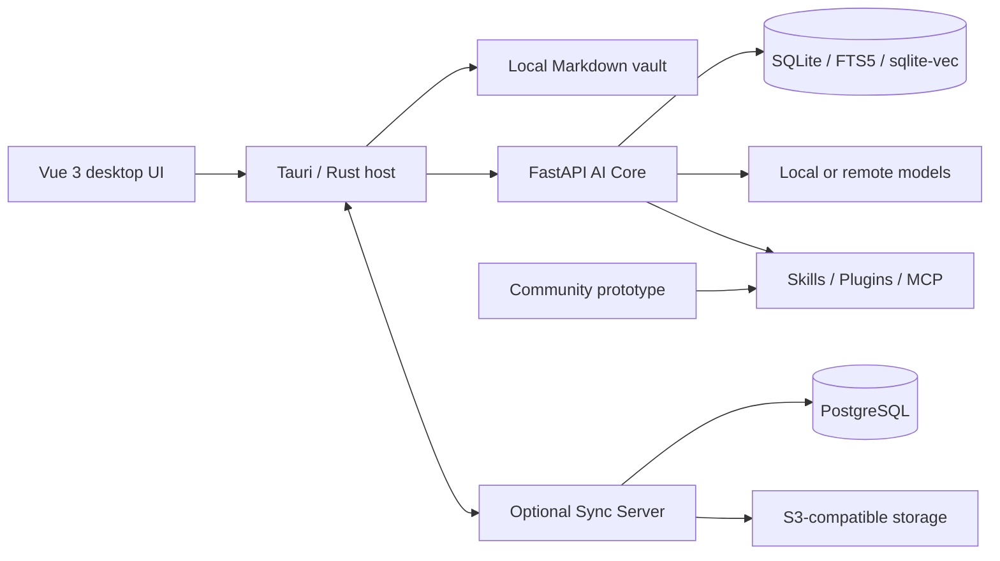

# OpenNexus

[简体中文](README.zh-CN.md) | **English**


OpenNexus is a local-first AI notebook and knowledge workspace. It combines Markdown vaults, hybrid retrieval, grounded chat, auditable agents, media-to-notes workflows, extensions, and optional multi-device synchronization in one desktop application.

> Current release: **0.5.2-alpha1**. Back up important vaults before upgrading an alpha build.

## Highlights

- **Course recordings to structured notes** — transcribe real audio or video, review timestamped text, and generate knowledge-point notes with code blocks, Mermaid diagrams, formulas, and function plots when appropriate.
- **Personal planning agents** — create goal-oriented agents, generate plans and tasks, control tool permissions, and inspect execution traces.
- **Local-first knowledge base** — edit Markdown, manage attachments, and combine SQLite FTS5, vector retrieval, reciprocal-rank fusion, and reranking.
- **Provider choice** — connect OpenAI, Anthropic, Ollama, DeepSeek, and OpenAI-compatible endpoints without storing credentials in the WebView.
- **Extensible workspace** — install Skills, Plugins, themes, and MCP integrations with explicit permissions and trust review.
- **Portable output** — export notes to PDF, HTML, and DOCX; workspace images use content-addressed relative paths.
- **Optional synchronization** — sync notes and attachments between devices with conflict preview, revision history, and device revocation.

## Architecture



The desktop host owns local filesystem access, credentials, process supervision, and privileged extension operations. The AI Core runs as a separately supervised process over an authenticated local channel. Optional Sync Server and community services are maintained in separate repositories.

## Repository layout

| Path | Purpose |
| --- | --- |
| `frontend/` | Vue 3 UI and Tauri/Rust desktop host |
| `backend/` | FastAPI AI Core, retrieval, agents, media processing, and export |
| `scripts/` | Build, acceptance, and release automation |
| `tools/` | Local development and packaging utilities |

## Public repositories

| Component | GitHub repository |
| --- | --- |
| Desktop application and AI Core | [KiriAky107/OpenNexus](https://github.com/KiriAky107/OpenNexus) |
| Sync Server | [KiriAky107/Sync-for-OpenNexus](https://github.com/KiriAky107/Sync-for-OpenNexus) |
| Community prototype | [KiriAky107/Community-for-OpenNexus](https://github.com/KiriAky107/Community-for-OpenNexus) |

This repository contains only the desktop application and AI Core. The two optional server components are versioned and deployed independently.

## Install the desktop app

1. Download `OpenNexus_0.5.2-alpha1_x64-setup.exe` from the [v0.5.2-alpha1 release](https://gitea.kronecker.cc/Kronecker/NotesAgentic/releases/tag/v0.5.2-alpha1).
2. Verify the published SHA-256 checksum.
3. Run the installer and start OpenNexus from the Start menu.
4. Select or create a Markdown vault.
5. Configure a local or remote model under **Settings → Model providers**.

The installer contains no user vault, downloaded model weights, CUDA runtime, or preinstalled community package. Existing configuration and indexes remain under `%APPDATA%\cc.kronecker.notesagent` during an in-place upgrade.

## Development

### Requirements

| Tool | Version |
| --- | --- |
| Node.js | 22+ |
| pnpm | 10.28.0 |
| Python | 3.12+ |
| uv | 0.9.24 |
| Rust | stable |

Install dependencies:

```powershell
cd backend
uv sync --frozen

cd ../frontend
corepack enable
corepack prepare pnpm@10.28.0 --activate
pnpm install --frozen-lockfile
```

Run the web development stack:

```powershell
# Terminal 1: AI Core
cd backend
uv run python scripts/dev-server.py

# Terminal 2: frontend
cd frontend
pnpm dev
```

Build the Windows desktop application:

```powershell
cd frontend
pnpm desktop:build
```

## Tests

```powershell
# Backend
cd backend
uv run pytest

# Frontend
cd ../frontend
pnpm test
pnpm type-check
pnpm build

# Rust host
cd src-tauri
cargo fmt --check
cargo test --all-targets --features desktop
cargo clippy --all-targets --features desktop -- -D warnings

```

## Security and privacy

- Vault content stays local unless the user explicitly enables a remote model, synchronization, or another network integration.
- Provider credentials are stored by the desktop credential vault and are not persisted in frontend `localStorage`.
- Extension permissions, network access, and privileged tool calls are reviewed before authorization.
- Logs and bug reports must not contain vault text, access tokens, provider keys, or personal information.
- Only install Skills, Plugins, themes, and MCP servers from sources you trust.

Please report security issues privately to the repository maintainers instead of opening a public issue with sensitive details.

## Contributing

Use locked dependencies, keep frontend/backend contracts synchronized, and run the relevant test suites before submitting a change. Commit messages follow Conventional Commits, for example:

```text
feat(sync): add device revocation
fix(export): restore PDF rendering in packaged builds
test(agent): cover interrupted task recovery
```

OpenNexus is currently an alpha project. Issues should include the application version, operating system, reproduction steps, and redacted correlation IDs.

## License

OpenNexus project code is licensed under the [MIT License](LICENSE). Bundled models, libraries, fonts, icons, and other third-party components remain subject to their own licenses and notices; the project MIT License does not replace those terms.
