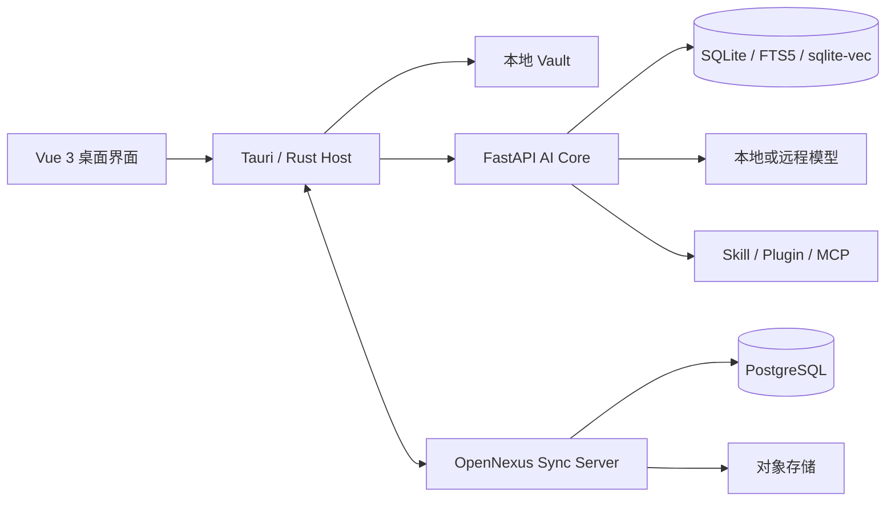

# OpenNexus

OpenNexus 是一款本地优先的 AI 笔记与知识中枢。它将 Markdown Vault、全文与向量检索、知识库问答、可审计 Agent、扩展系统和多设备同步整合在一个桌面应用中。笔记与索引由用户掌控；需要模型或同步服务时，再按需连接本地或远程服务。

当前预发布版本为 **0.3.1-alpha.2**，主要支持 Windows x64。Alpha 版本用于验证完整业务闭环和部署方案，升级前请备份 Vault。

## 主要能力

- **本地知识库**：管理多个 Vault，编辑 Markdown，索引文件与附件，并保留可迁移的数据目录。
- **检索与问答**：结合 FTS5、sqlite-vec、RRF 和轻量精排，回答中可定位引用来源。
- **AI 与 Agent**：支持 OpenAI、Anthropic、Ollama 及兼容接口；Agent 提供权限确认、执行轨迹、任务恢复和工具调用。
- **工具与扩展**：内置知识库、文件、导出、函数绘图等工具，可安装 Skill、Plugin，并连接 MCP 服务。
- **内容呈现**：支持 Mermaid、LaTeX、函数图像、多语言代码、主题和中英文界面。
- **桌面安全边界**：Tauri/Rust Host 负责本地能力，凭据由 Stronghold 管理，Core 通过受控进程和认证通道访问。
- **同步服务**：Sync v1 提供账户、设备、增量同步、冲突处理、对象存储和 Vue 3 管理控制台。
- **运行诊断**：记录脱敏运行日志、Agent Trace、模型用量和错误关联信息。

## 系统结构



桌面端默认在本机运行。Sync Server 是可选组件，只有启用同步时才需要部署。

## 使用发布包

本版提供 Windows x64 便携包和独立的 Server Sync 包，下载入口见 [v0.3.1-alpha.2 发布页](https://gitea.kronecker.cc/Kronecker/NotesAgentic/releases/tag/v0.3.1-alpha.2)。发布页同时附带 `SHA256.json`，用于核对文件完整性。

便携包是干净的首次安装环境，不包含任何 Vault 或用户数据，也不预装已下载的社区主题、本地模型权重、CUDA 与 PyTorch 运行时。相关功能仍完整保留；需要时可在客户端内按需安装主题、选择模型或配置 CUDA 环境。程序自带的基础界面样式属于客户端资源，不视为社区主题。

1. 下载 Windows x64 软件包，并核对发布页中的 SHA-256。
2. 将便携版完整解压到可写目录，不要单独移动可执行文件。
3. 启动 `OpenNexus.exe`，选择已有 Vault 或创建新 Vault。
4. 在“设置 → 模型提供商”中配置本地模型或远程模型凭据。
5. 如需多设备同步，在同步设置中填写管理员提供的 Sync Server 地址并登录。

凭据不会写入前端 `localStorage`。首次试用建议复制一份现有笔记目录，再用副本验证索引和同步行为。

### 工作区图片存储

在源码或所见即所得编辑器中粘贴、拖入或选择 PNG、JPEG、GIF、WebP 图片后，OpenNexus 会按内容哈希保存到当前 Vault 的 `attachments/<哈希前两位>/<SHA-256>.<扩展名>`。Markdown 使用相对路径引用图片，因此笔记目录整体复制、导出或同步后仍可定位原图；单张图片上限为 5 MiB，相同内容只保存一份。

图片二进制不写入 SQLite。数据库中的 `workspace_assets` 保存路径、SHA-256、媒体类型、大小和原始文件名，`workspace_asset_links` 保存图片与笔记的引用关系。另一台设备收到 Vault 文件后，会在首次显示图片时校验路径哈希并重建本机元数据。

## 开发环境

| 工具 | 版本 |
| --- | --- |
| Node.js | 22 或更高版本 |
| pnpm | 10.28.0 |
| Python | 3.12 或更高版本 |
| uv | 0.9.24 |
| Rust | stable，桌面构建需要 |

安装依赖：

```powershell
cd backend
uv sync --frozen
cd ../frontend
corepack enable
corepack prepare pnpm@10.28.0 --activate
pnpm install --frozen-lockfile
```

启动 Web 开发环境：

```powershell
# 终端一：AI Core
cd backend
uv run python scripts/dev-server.py

# 终端二：前端
cd frontend
pnpm dev
```

前端默认地址为 <http://127.0.0.1:5173>，开发代理将 `/api` 和 `/health` 转发到 <http://127.0.0.1:8000>。后端接口文档位于 <http://127.0.0.1:8000/docs>。

启动和构建桌面应用：

```powershell
cd frontend
pnpm desktop:dev
pnpm desktop:build
```

## 运行测试

```powershell
# 后端
cd backend
uv run pytest

# 前端
cd ../frontend
pnpm test
pnpm type-check
pnpm build

# Rust Host
cd src-tauri
cargo fmt --check
cargo test --all-targets --features desktop
cargo clippy --all-targets --features desktop -- -D warnings

# Sync Server（从仓库根目录进入）
cd "../../server sync"
uv sync --frozen
uv run pytest
```

Gitea Actions 会在推送和合并请求时执行文档检查、后端测试、Sync 与社区服务测试、前端测试和 Rust Core 检查。签名 Windows 安装包由受控 Windows Runner 生成；签名材料只通过仓库 Secret 注入。

## 部署 Sync Server

开发或内网验证可直接运行：

```powershell
cd "server sync"
uv sync --frozen
uv run uvicorn sync_server.main:app --host 0.0.0.0 --port 18080
```

管理控制台构建后由 Sync Server 一并提供。正式环境应使用 PostgreSQL、S3 兼容对象存储、独立密钥、TLS 终止、进程守护和定期备份；完整变量与部署方式见 [`server sync/README.md`](server%20sync/README.md)。

新建 Sync 实例首次启动时会生成仅对本次启动有效的随机管理员密码。管理员首次登录后必须修改账户和密码；修改成功后凭据写入数据库，后续重启不再随机更换。升级已有实例会保留已固定的凭据、Vault、设备和修订记录。

## 仓库结构

```text
OpenNexus/
├── frontend/          Vue 3 前端与 Tauri/Rust 桌面宿主
├── backend/           FastAPI AI Core、检索、Agent 与模型运行
├── server sync/       Sync v1 服务及 Vue 管理控制台
├── community-server/  扩展社区服务
├── scripts/           构建、验收和发布脚本
├── docs/              架构、接口契约、开发与验收记录
└── .gitea/workflows/  持续集成与签名发布流水线
```

## 文档入口

- [文档索引](docs/README.md)
- [前端开发说明](frontend/README.md)
- [后端开发说明](backend/README.md)
- [Sync Server 说明](server%20sync/README.md)
- [第三阶段实施与验收记录](docs/development/第三阶段实施与验收记录.md)
- [后端接口契约](docs/contracts/后端接口契约-开发版.md)

## 安全与发布

OpenNexus 将 Vault 内容、模型凭据和扩展权限视为敏感数据。请只安装可信来源的 Skill、Plugin 与主题包，并在授权前检查其权限。服务端部署不得使用示例密钥或开发数据库。

正式发行物通过 Git 标签追踪，并在发布页提供校验和。Windows 安装包的生产门禁还会验证 Authenticode 和 Core 清单签名。无法通过签名门禁的构建只能作为预发布测试包分发。

## 参与开发

提交前请保持前后端契约、类型和文档同步，使用 pnpm、uv 与锁文件安装依赖，并确保相关测试通过。提交信息采用 Conventional Commits，类型标识保留英文，说明使用中文，例如：

```text
feat(sync): 增加设备撤销接口
fix(agent): 修复任务恢复时的重复事件
docs: 更新部署说明
```

项目仍处于 Alpha 阶段。问题报告应包含版本、操作系统、复现步骤和脱敏后的关联 ID，避免附带 Vault 正文、访问令牌或服务密钥。
