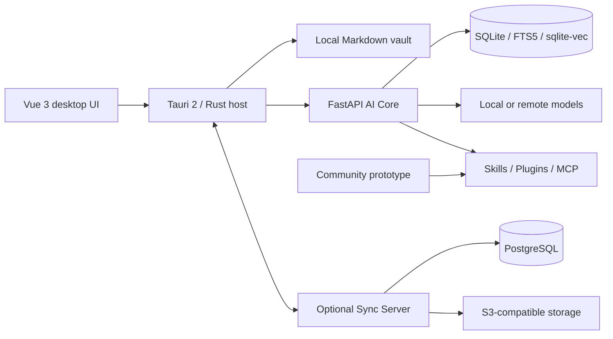

# OpenNexus

[简体中文](README.zh-CN.md) | **English**

[](https://github.com/KiriAky107/OpenNexus/releases/tag/v0.5.2-alpha1)


[](LICENSE)

OpenNexus is a local-first AI notebook and knowledge workspace. It combines Markdown vaults, hybrid retrieval, grounded chat, auditable agents, media-to-notes workflows, an extension runtime, and optional multi-device synchronization in a Windows desktop application.

> The current release is **0.5.2-alpha1**. The project is usable for evaluation and demonstrations, but its storage schema and extension interfaces may still change. Back up important vaults before upgrading.

## Table of contents

- [Why OpenNexus](#why-opennexus)
- [Core workflows](#core-workflows)
- [Architecture](#architecture)
- [Repository boundaries](#repository-boundaries)
- [Installation](#installation)
- [Development](#development)
- [Configuration and data](#configuration-and-data)
- [Testing](#testing)
- [Packaging and release](#packaging-and-release)
- [Security and privacy](#security-and-privacy)
- [Contributing](#contributing)
- [License](#license)
- [Issue requirements](#issue-requirements)
- [Pull request requirements](#pull-request-requirements)

## Why OpenNexus

OpenNexus treats notes as portable files rather than records locked inside a hosted service. The desktop host owns privileged local operations, while the AI Core exposes a narrow local API for retrieval, generation, agents, transcription, and export. Remote services are optional and can be deployed independently.

The design focuses on four properties:

- **Local ownership:** notes remain ordinary Markdown files with relative, content-addressed attachments.
- **Traceable AI:** retrieved context, tool permissions, task states, and agent execution records remain inspectable.
- **Replaceable models:** local models and multiple remote providers can be selected without coupling the vault to one vendor.
- **Composable extensions:** Skills, Plugins, themes, and MCP servers use explicit manifests and permission review.

## Core workflows

### Course recordings to knowledge notes

Import real audio or video, produce timestamped transcript segments, correct the transcript, and generate a separate knowledge-point note. When the material requires it, generated notes may include code blocks, mathematical formulas, Mermaid diagrams, and function plots. Transcription and note generation are separate stages so that the source transcript remains reviewable.

### Personal planning agents

Create a goal-oriented Agent, let it produce a plan and actionable tasks, authorize only the tools it needs, and inspect the execution history. Task state is persisted so interrupted work can be diagnosed and resumed instead of silently disappearing.

### Knowledge workspace

- Edit Markdown with source and rich-writing modes.
- Index content with SQLite FTS5 and vector search.
- Combine retrieval results with reciprocal-rank fusion and optional reranking.
- Ask grounded questions against the selected vault.
- Export the current editor snapshot to PDF, HTML, or DOCX.
- Import Markdown and presentation material into reusable notes.

### Extensions and optional services

- Install Skills and Plugins at demonstration time instead of bundling them into a user vault.
- Connect MCP servers through supported transports and keep process lifecycle separate from the AI Core where appropriate.
- Apply community themes and packages only after reviewing their origin and requested permissions.
- Synchronize notes and attachments through the independently deployed Sync Server.

## Architecture



| Layer | Responsibility | Trust boundary |
| --- | --- | --- |
| Vue frontend | Workspace, editor, search, chat, Agent, media, extension, and settings UI | No direct credential persistence |
| Tauri/Rust host | Filesystem access, native dialogs, process supervision, credential vault, and privileged commands | Desktop security boundary |
| FastAPI AI Core | Retrieval, model adapters, agents, transcription, indexing, and export orchestration | Authenticated local channel |
| Vault | Markdown notes, attachments, and local metadata | User-controlled directory |
| Optional services | Sync and community distribution | Separate repositories and deployment lifecycle |

The AI Core is supervised by the desktop host but is not the owner of unrelated MCP processes. Production behavior must not depend on development-only `stdio` assumptions.

## Repository boundaries

| Path | Purpose |
| --- | --- |
| `frontend/` | Vue 3 application and the Tauri/Rust desktop host |
| `frontend/src-tauri/` | Native commands, capabilities, sidecar supervision, and NSIS bundle configuration |
| `backend/` | FastAPI AI Core, retrieval, agents, media processing, model adapters, and export |
| `backend/tests/` | Backend unit and integration tests |
| `scripts/` | Build, acceptance, verification, and release automation |
| `tools/` | Development and packaging utilities |

Public components are maintained separately:

| Component | Repository |
| --- | --- |
| Desktop application and AI Core | [KiriAky107/OpenNexus](https://github.com/KiriAky107/OpenNexus) |
| Sync Server | [KiriAky107/Sync-for-OpenNexus](https://github.com/KiriAky107/Sync-for-OpenNexus) |
| Community prototype | [KiriAky107/Community-for-OpenNexus](https://github.com/KiriAky107/Community-for-OpenNexus) |

This repository must not absorb Sync Server or community deployment code. Cross-repository changes should document compatible versions and be released independently.

## Installation

### Windows installer

1. Download `OpenNexus_0.5.2-alpha1_x64-setup.exe` from the [GitHub release](https://github.com/KiriAky107/OpenNexus/releases/tag/v0.5.2-alpha1).
2. Verify its SHA-256 checksum:

   ```powershell
   Get-FileHash .\OpenNexus_0.5.2-alpha1_x64-setup.exe -Algorithm SHA256
   ```

   Expected value:

   ```text
   F1B88FDF1D3AE0B48B3D2907818A52B843E39BF94E94B4A913EC6AFD26EC8786
   ```

3. Run the installer, launch OpenNexus from the Start menu, and select or create a Markdown vault.
4. Open **Settings → Model providers** and configure a local or remote provider.

The installer does not contain a user vault, downloaded model weights, a CUDA runtime, or preinstalled community packages. An in-place upgrade keeps the current Windows user's application data under `%APPDATA%\cc.kronecker.notesagent`.

## Development

### Prerequisites

| Tool | Supported baseline |
| --- | --- |
| Windows | Windows 10/11 x64 |
| Node.js | 22 or later |
| pnpm | 10.28.0 |
| Python | 3.11 or later |
| uv | 0.9.24 or compatible |
| Rust | Current stable toolchain with MSVC target |
| WebView2 | Current Microsoft Edge WebView2 runtime |

Media processing, local inference, and some export paths may require additional runtimes. Install them only for the feature under test; do not commit downloaded models or runtime archives.

### Clone and install dependencies

```powershell
git clone https://github.com/KiriAky107/OpenNexus.git
cd OpenNexus

cd backend
uv sync --frozen

cd ..\frontend
corepack enable
corepack prepare pnpm@10.28.0 --activate
pnpm install --frozen-lockfile
```

Dependency lock files are part of the build contract. Update them in the same pull request as the corresponding manifest change.

### Run the development stack

```powershell
# Terminal 1: AI Core
cd backend
uv run python scripts/dev-server.py

# Terminal 2: web frontend
cd frontend
pnpm dev
```

For desktop integration work, run the Tauri development command from `frontend/` with the required sidecar artifacts available. The packaged application must be tested separately because browser-only development mode does not cover native dialogs, credential storage, sidecar startup, or installer paths.

### Useful frontend commands

```powershell
cd frontend
pnpm type-check
pnpm test
pnpm build
pnpm build:report
```

## Configuration and data

- A vault is a user-selected directory and is not part of the application repository.
- Provider secrets belong in the desktop credential vault; never place API keys in source files, screenshots, logs, fixtures, or `localStorage`.
- Indexes and generated caches can be rebuilt and must not be treated as the source of truth for notes.
- Remote synchronization is opt-in. Review the endpoint, TLS configuration, device name, and selected sync categories before signing in.
- Extension packages are untrusted input until their manifests, checksums, permissions, and executable contents have been reviewed.
- Logs used in bug reports must be redacted. Preserve correlation IDs where useful, but remove vault content, credentials, personal paths, hostnames, and personal information.

## Testing

Run the checks relevant to the changed layer before opening a pull request:

```powershell
# Backend tests
cd backend
uv run pytest

# Frontend tests and production build
cd ..\frontend
pnpm test
pnpm type-check
pnpm build

# Native host checks
cd src-tauri
cargo fmt --check
cargo test --all-targets --features desktop
cargo clippy --all-targets --features desktop -- -D warnings
```

For changes that cross process or repository boundaries, also run the applicable scripts under `scripts/` and document the acceptance scenario. Release candidates should cover startup, vault selection, provider restart recovery, transcript-to-note generation, Agent planning, extension installation, native save dialogs, PDF/HTML/DOCX export, and optional sync authentication.

Tests must be deterministic, must not depend on a contributor's personal vault or credentials, and must clean up temporary processes and files.

## Packaging and release

Build the Windows NSIS installer from `frontend/`:

```powershell
pnpm desktop:build
```

The desktop build runs the production frontend build and uses `frontend/src-tauri/tauri.bundle.conf.json`. Before publishing a release:

1. Synchronize versions in the frontend package, Tauri configuration, Rust package, and Python package metadata.
2. Build the AI Core sidecar and verify that the packaged desktop host starts the matching artifact.
3. Run frontend, backend, Rust, and release acceptance checks.
4. Install the generated setup executable on a clean Windows user profile.
5. Verify native file dialogs and PDF, HTML, and DOCX exports from the installed application.
6. Calculate and publish SHA-256 checksums.
7. Create an annotated version tag and a non-draft GitHub Release.
8. Keep source archives free of vaults, credentials, personal documents, generated caches, and unrelated service repositories.

Version tags use the `v<version>` form. Alpha versions can be published as normal releases when that status is intentional, but their compatibility limitations must remain clear in the release notes.

## Security and privacy

- Vault content stays local unless the user explicitly enables a remote model, synchronization, or another network integration.
- Provider credentials are handled by the desktop credential vault and must not be persisted by the WebView.
- Extension permissions, network access, and privileged tool calls require explicit review and authorization.
- Native commands must validate paths and must not broaden filesystem access beyond the selected vault or explicit user action.
- Only install Skills, Plugins, themes, and MCP servers from sources you trust.

Do not publish exploitable security details or real secrets in a public issue. Use a private maintainer contact or GitHub's private vulnerability reporting when it is enabled.

## Contributing

- Keep changes focused on one problem and respect the repository boundaries above.
- Keep frontend types, backend schemas, native commands, and tests synchronized when an interface changes.
- Use locked dependencies and explain new runtime dependencies, their licenses, and their packaging impact.
- Use Conventional Commits, for example:

  ```text
  feat(agent): persist interrupted planning tasks
  fix(export): restore PDF rendering in packaged builds
  test(media): cover transcript-to-note generation
  docs(readme): clarify Windows release verification
  ```

- Update both `README.md` and `README.zh-CN.md` when shared documentation changes.
- Do not commit user vaults, personal documents, credentials, model weights, build output, or identifying competition material.

## License

OpenNexus project code is licensed under the [MIT License](LICENSE). Bundled or downloaded models, libraries, fonts, icons, and other third-party components remain subject to their own licenses and notices. The project MIT License does not replace those terms.

## Issue requirements

Before opening an issue:

1. Search open and closed issues and confirm that the problem is not already tracked.
2. Use a specific title and identify whether the report is a bug, feature request, documentation problem, or compatibility question.
3. For bugs, include the OpenNexus version or commit, Windows version, installation type, affected component, expected result, actual result, and the smallest reproducible sequence.
4. Attach only the minimum necessary screenshots or logs. Redact API keys, tokens, vault text, personal paths, account details, hostnames, and personal information.
5. State whether the problem reproduces in the packaged desktop application, web development mode, or both.
6. Include relevant model/provider, extension, MCP transport, and Sync Server versions without exposing credentials.
7. Security vulnerabilities and leaked secrets must be reported privately, not through a public issue.

Issues that only say “does not work,” omit reproducible information, duplicate an existing report, or expose private data may be closed until corrected.

## Pull request requirements

A pull request must:

1. Reference the related issue or clearly explain the motivation and user-visible outcome.
2. Contain one reviewable logical change; unrelated refactors and generated files must be separated.
3. Use a feature branch and Conventional Commits. Do not rewrite other contributors' branches or force-update the default branch.
4. Include tests for behavior changes and list the exact commands and acceptance scenarios that passed.
5. Update both language versions of shared documentation and update release notes when behavior, configuration, or compatibility changes.
6. Document frontend/backend/native contract changes, data migrations, rollback behavior, and cross-repository version requirements.
7. Explain every new dependency, including its purpose, license, runtime size, and installer impact.
8. Include before/after screenshots for UI changes and redact all personal or sensitive information.
9. Exclude credentials, private vaults, personal documents, downloaded models, build artifacts, and competition-identifying material.
10. Pass formatting, type checking, tests, production builds, and applicable packaged-desktop acceptance checks before requesting review.

Draft pull requests are welcome for early technical discussion. Mark the pull request ready only when the checklist is complete and the branch can be reviewed without access to private infrastructure or personal data.
