<div align="center">

  

  <h1>OpenNexus</h1>

  <p><strong>The Local-First, AI-Native Knowledge Workspace</strong></p>

  <p>
    Own your data. Ground your AI. Turn scattered media, thoughts, and research into structured, connected knowledge — fully offline or plugged into the models of your choice.
  </p>

  <p>
    <a href="README.zh-CN.md">简体中文</a> •
    <a href="#quick-start">Quick Start</a> •
    <a href="#why-opennexus">Key Features</a> •
    <a href="#architecture">Architecture</a> •
    <a href="#development">Development</a> •
    <a href="https://github.com/KiriAky107/OpenNexus/releases">Releases</a>
  </p>

  <p>
    <a href="https://github.com/KiriAky107/OpenNexus/releases/tag/v0.5.6-alpha2"></a>
    
    
    
    
    <a href="LICENSE"></a>
    <a href="visitors"></a>
  </p>

</div>

---

> ⚠️ **Alpha Notice**: OpenNexus is currently in active alpha (`v0.5.6-alpha2`). Storage schemas, IPC contracts, and extension APIs are evolving. Always back up critical Markdown vaults before updating.

<div align="center">
  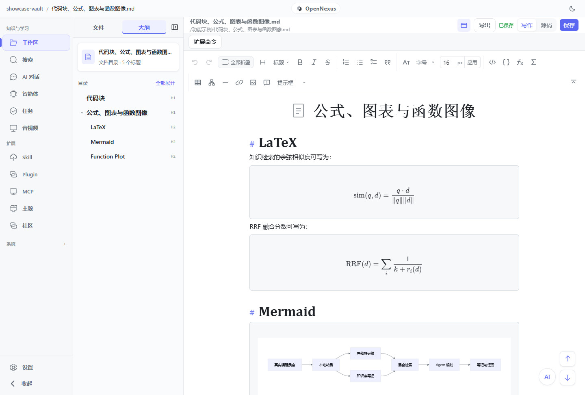
  <p><em>The OpenNexus desktop environment: Local Markdown vault, RRF hybrid retrieval, and real-time AI Core status.</em></p>
</div>

<table align="center">
  <tr>
    <td width="50%">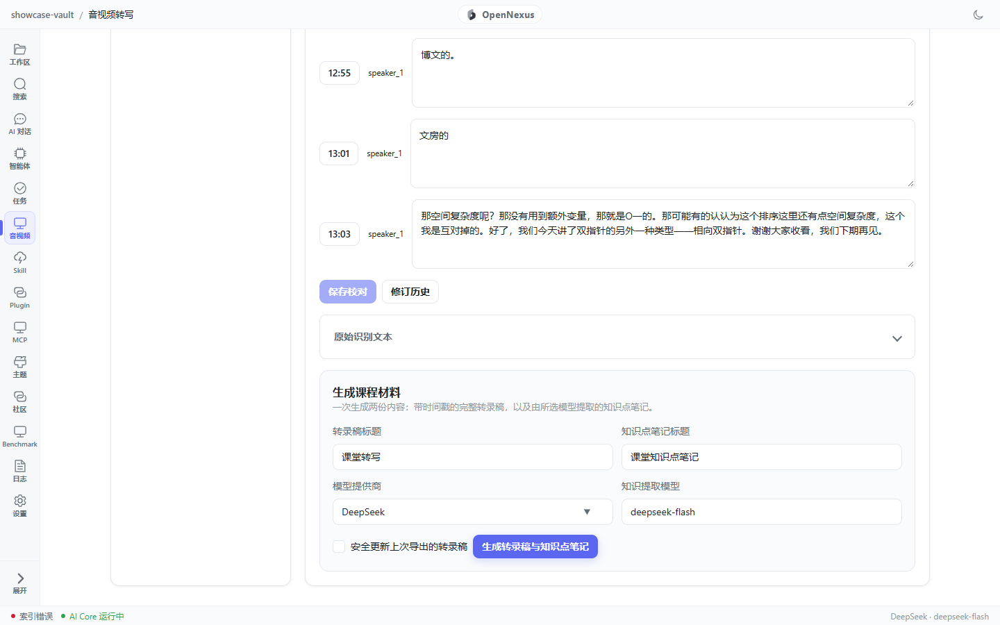</td>
    <td width="50%">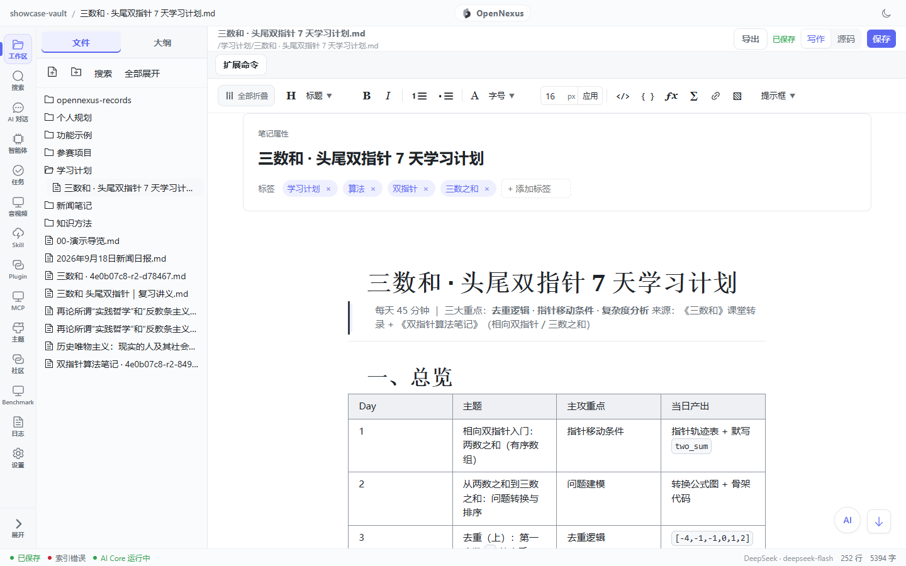</td>
  </tr>
  <tr>
    <td width="50%">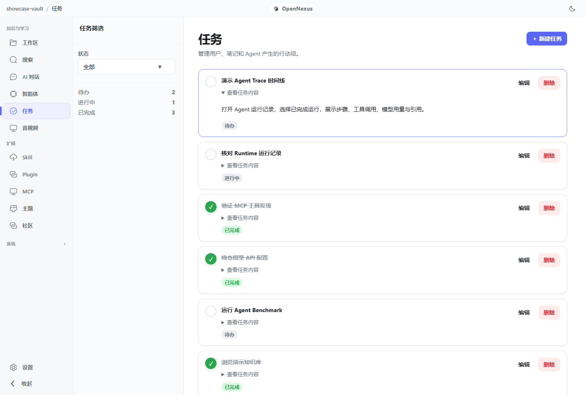</td>
    <td width="50%">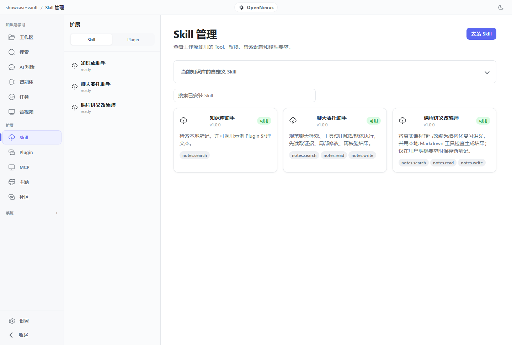</td>
  </tr>
  <tr>
    <td width="50%">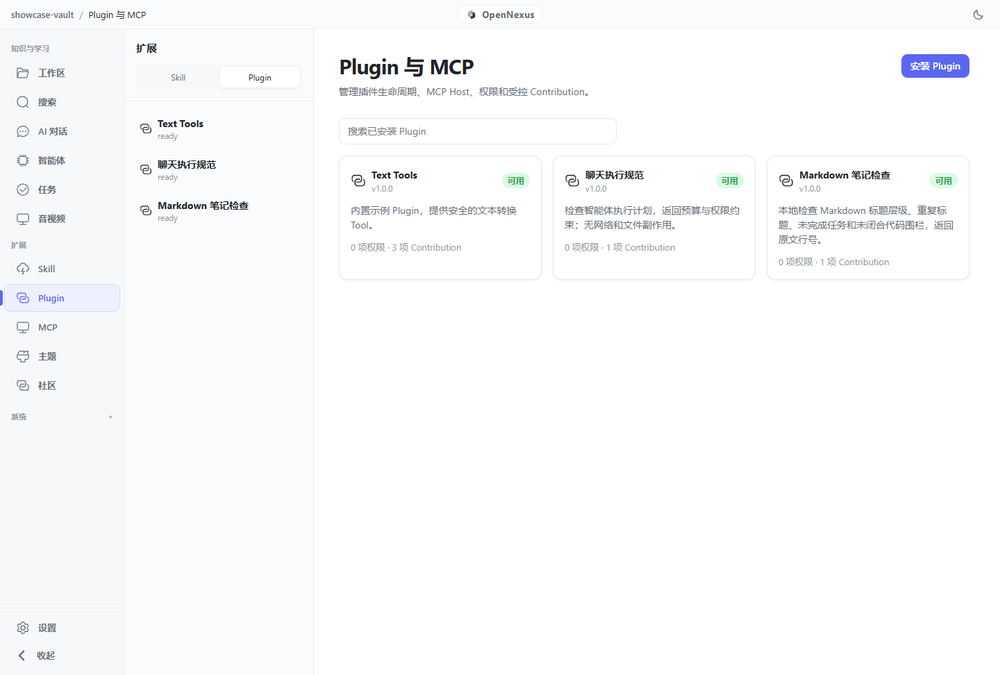</td>
    <td width="50%">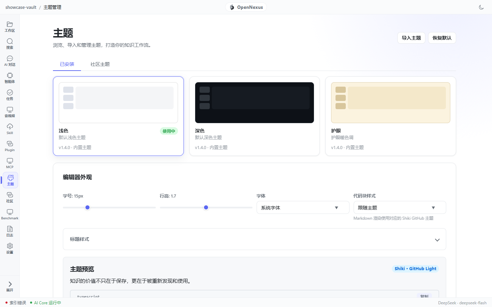</td>
  </tr>
  <tr>
    <td width="50%">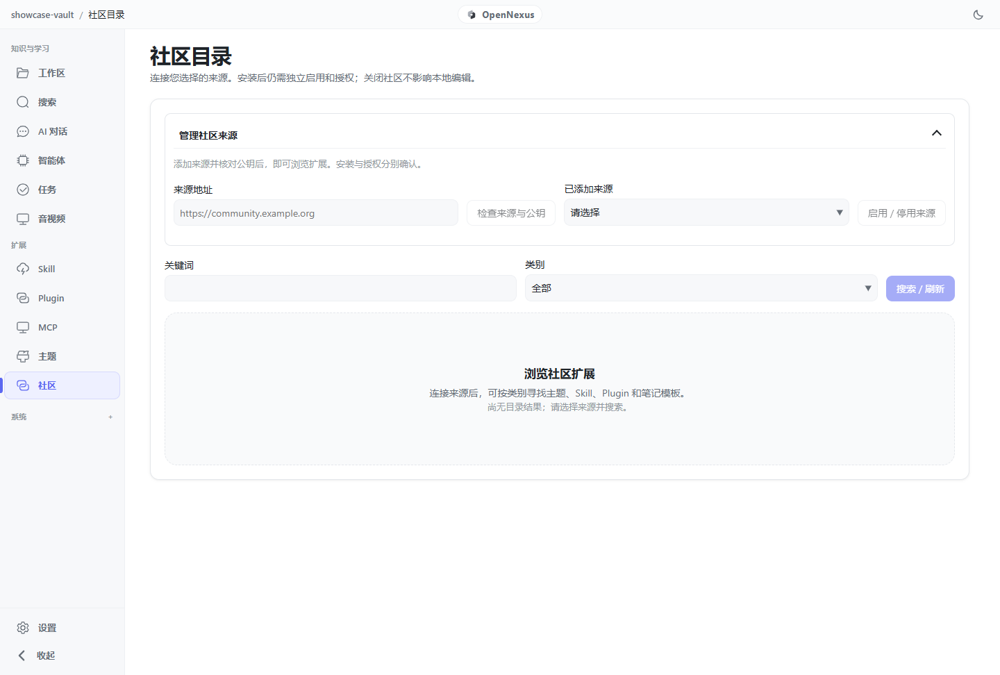</td>
    <td width="50%">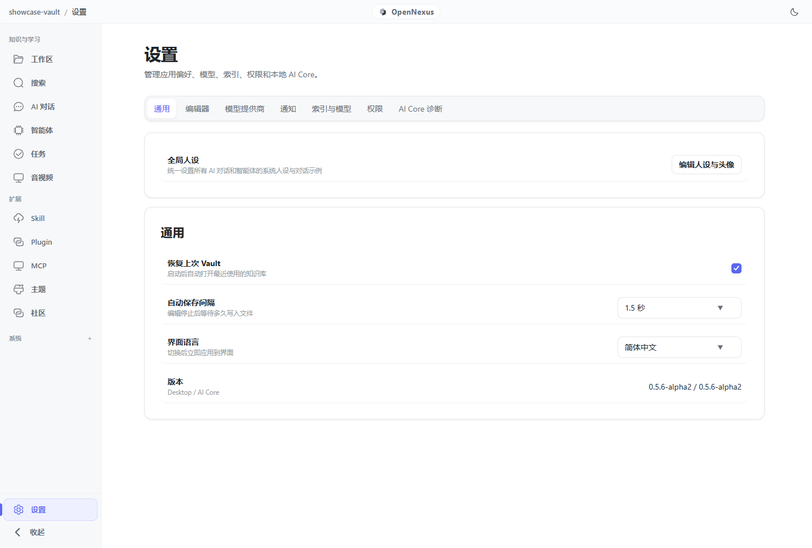</td>
  </tr>
</table>

---

## Highlights

- 📁 **Zero Vendor Lock-In**: Notes are plain, portable Markdown files with relative content-addressed assets. Move them anywhere, anytime.
- 🔍 **Hybrid Local Retrieval**: Combines SQLite FTS5 lexical matching with local vector embeddings using Reciprocal Rank Fusion (RRF) and optional reranking.
- 🎙️ **Media-to-Knowledge**: Turn lecture recordings, podcasts, and meetings into timestamped transcripts, Mermaid diagrams, formulas, and structured notes.
- 🛡️ **Inspectable Autonomous Agents**: Every tool execution, permission boundary, and state change is snapshotted and auditable. No hidden background magic.
- 🔌 **Extensible Ecosystem**: Built-in support for MCP (Model Context Protocol) servers, custom plugins, and reviewed community packages.
- ⚡ **Strict Local-First Security**: Secrets stay securely stored in the native credential manager. The frontend WebView never touches raw API keys or unrestricted file paths.

---

## Quick Start

### Windows Desktop (Recommended)

1. Grab the latest installer: [`OpenNexus_0.5.6-alpha2_x64-setup.exe`](https://github.com/KiriAky107/OpenNexus/releases/tag/v0.5.6-alpha2).
2. *(Optional)* Verify integrity via PowerShell:
```powershell
   Get-FileHash .\OpenNexus_0.5.6-alpha2_x64-setup.exe -Algorithm SHA256
   # Expected: 80E7A1BC489E8CBE19A9B9B5F9189EA1519D78CD2D5756CDA7F9009D7F2F5ACF

```

3. Run the installer and launch OpenNexus.
4. Select or initialize a directory as your Markdown Vault.
5. Head to **Settings → Model Providers** to connect your preferred local runtime (Ollama, vLLM) or cloud API key.

> Application configuration is persisted under `%APPDATA%\cc.kronecker.notesagent`. Existing vaults remain untouched during in-place upgrades.

---

## Core Workflows

### 1. From Recording to Knowledge Note

Transform noisy audio/video into clean, deeply referenced knowledge with an editable transcript audit loop:

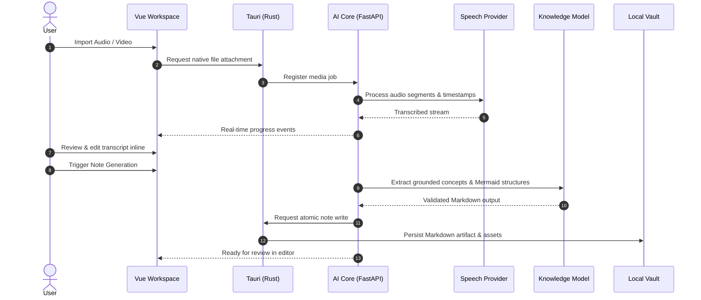

### 2. Controllable & Resumable Agents

Agents run with strict human-in-the-loop permission gating. State transitions are event-sourced, so network drops or app restarts won't corrupt in-flight runs:

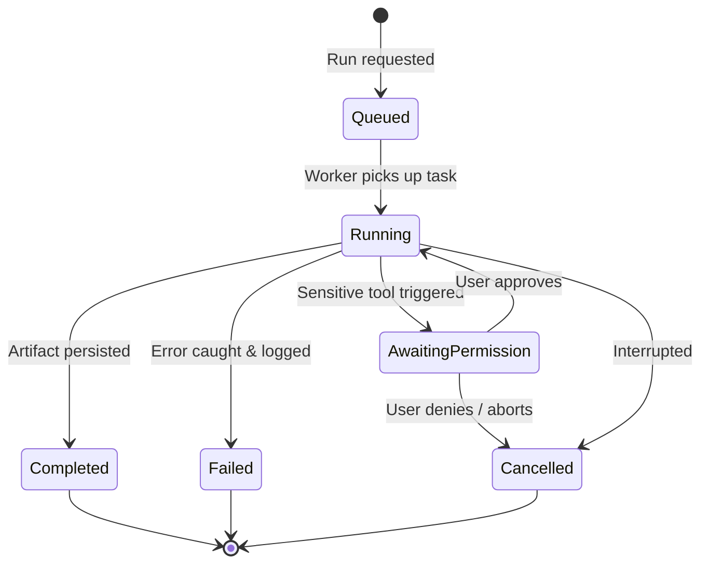

---

## Architecture

OpenNexus adopts a modular, three-tier architecture ensuring clean security boundaries and minimal IPC overhead:

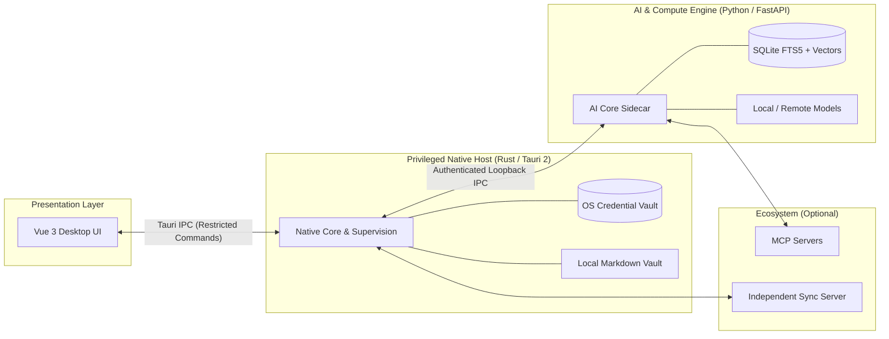

### Responsibility & Trust Boundaries

| Boundary | Technology | Responsibilities | Security Guarantee |
| --- | --- | --- | --- |
| **Presentation** | Vue 3 + Tailwind | Editor, chat UI, agent monitoring, settings | No access to raw secrets or unrestricted disk |
| **Native Host** | Tauri 2 (Rust) | OS integration, process supervisor, keychain | Strict path boundary checking for all FS operations |
| **AI Core** | FastAPI (Sidecar) | RAG pipeline, ASR, agent loops, embeddings | Authenticated local loopback only |
| **Vault** | Plain Files | Portable notes, attachments, indexes | 100% user-owned directory |

OpenNexus cleanly separates user data from application caches:

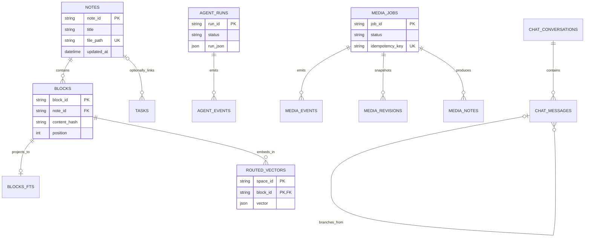

---

## Ecosystem Repositories

To keep dependencies clean and packaging predictable, services are maintained in separate repositories:

| Repository | Scope | Stack |
| --- | --- | --- |
| **[OpenNexus](https://github.com/KiriAky107/OpenNexus?utm_source=gemini)** | Desktop Application & AI Core | Tauri 2, Rust, Vue 3, FastAPI |
| **[Sync-for-OpenNexus](https://github.com/KiriAky107/Sync-for-OpenNexus?utm_source=gemini)** | Optional E2EE Sync Server | Rust / Go, PostgreSQL, S3 |
| **[Community-for-OpenNexus](https://github.com/KiriAky107/Community-for-OpenNexus?utm_source=gemini)** | Plugin catalog, skills, and templates | Static Catalog & Registry |

---

## Development

### Prerequisites

| Runtime | Required Version |
| --- | --- |
| **OS** | Windows 10/11 x64 |
| **Node.js** | `>= 22.0.0` (with `pnpm 10.28.0` via corepack) |
| **Python** | `>= 3.11` (managed via [`uv`](https://github.com/astral-sh/uv?utm_source=gemini)) |
| **Rust** | Current stable toolchain (`x86_64-pc-windows-msvc`) |
| **WebView2** | Microsoft Edge WebView2 runtime |

### 1. Setup Environment

```powershell
# Clone the repository
git clone [https://github.com/KiriAky107/OpenNexus.git](https://github.com/KiriAky107/OpenNexus.git)
cd OpenNexus

# Set up Python AI Core dependencies
cd backend
uv sync --frozen

# Set up Desktop Frontend dependencies
cd ..\frontend
corepack enable
corepack prepare pnpm@10.28.0 --activate
pnpm install --frozen-lockfile

```

### 2. Start Development Servers

```powershell
# Terminal 1: Run AI Core Sidecar
cd backend
uv run python scripts/dev-server.py

# Terminal 2: Run Web Interface
cd frontend
pnpm dev

```

> **Desktop Testing**: To test the complete Tauri host integration, run `pnpm tauri dev` from the `frontend/` directory with sidecar binaries properly staged.

### 3. Run Validation Suite

Ensure all checks pass before submitting pull requests:

```powershell
# Backend verification
cd backend
uv run pytest

# Frontend static analysis & tests
cd ..\frontend
pnpm type-check
pnpm test
pnpm build

# Native host lints & unit tests
cd src-tauri
cargo fmt --check
cargo test --all-targets --features desktop
cargo clippy --all-targets --features desktop -- -D warnings

```

---

## Packaging

Build a standalone Windows NSIS installer:

```powershell
cd frontend
pnpm desktop:build

```

The output installer will be generated in `frontend/src-tauri/target/release/bundle/nsis/`.

---

## Security & Privacy

* **Local Computation First**: Vault notes are processed strictly on-device unless external network providers are configured.
* **Credential Protection**: Model keys are stored in the OS Credential Vault; they are never accessible to Web content or stored in `localStorage`.
* **Scoped File Access**: The native host validates every path against the actively mounted vault root. Path traversal escapes are strictly blocked.
* **Vulnerability Reporting**: Found a security issue? Please report it privately through GitHub's [Private Vulnerability Reporting](https://www.google.com/search?q=https://github.com/KiriAky107/OpenNexus/security/advisories/new&utm_source=gemini).

---

## Contributing

We welcome contributions of all scopes! To maintain engineering velocity:

1. **Commit Convention**: Follow [Conventional Commits](https://www.conventionalcommits.org/?utm_source=gemini):
* `feat(agent): add tool execution retry logic`
* `fix(editor): prevent cursor jump during markdown table edit`
* `test(media): add regression coverage for corrupted audio chunks`


2. **Atomic Changes**: Keep PRs scoped to one logical concern. Include relevant unit tests and UI screenshots where applicable.
3. **Synchronized Documentation**: Update both `README.md` and `README.zh-CN.md` when proposing developer- or user-facing changes.

See our [Contributing Guide](https://www.google.com/search?q=CONTRIBUTING.md&utm_source=gemini) and [Code of Conduct](https://www.google.com/search?q=CODE_OF_CONDUCT.md&utm_source=gemini) for full details.

---

## License

OpenNexus is licensed under the [MIT License](https://www.google.com/search?q=LICENSE&utm_source=gemini). Third-party dependencies, bundled fonts, and model runtimes remain governed by their respective licenses.
