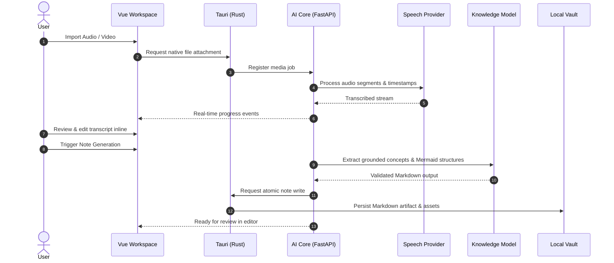
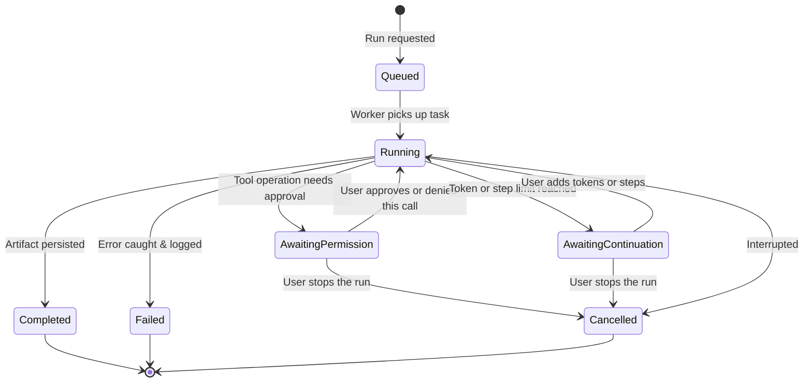
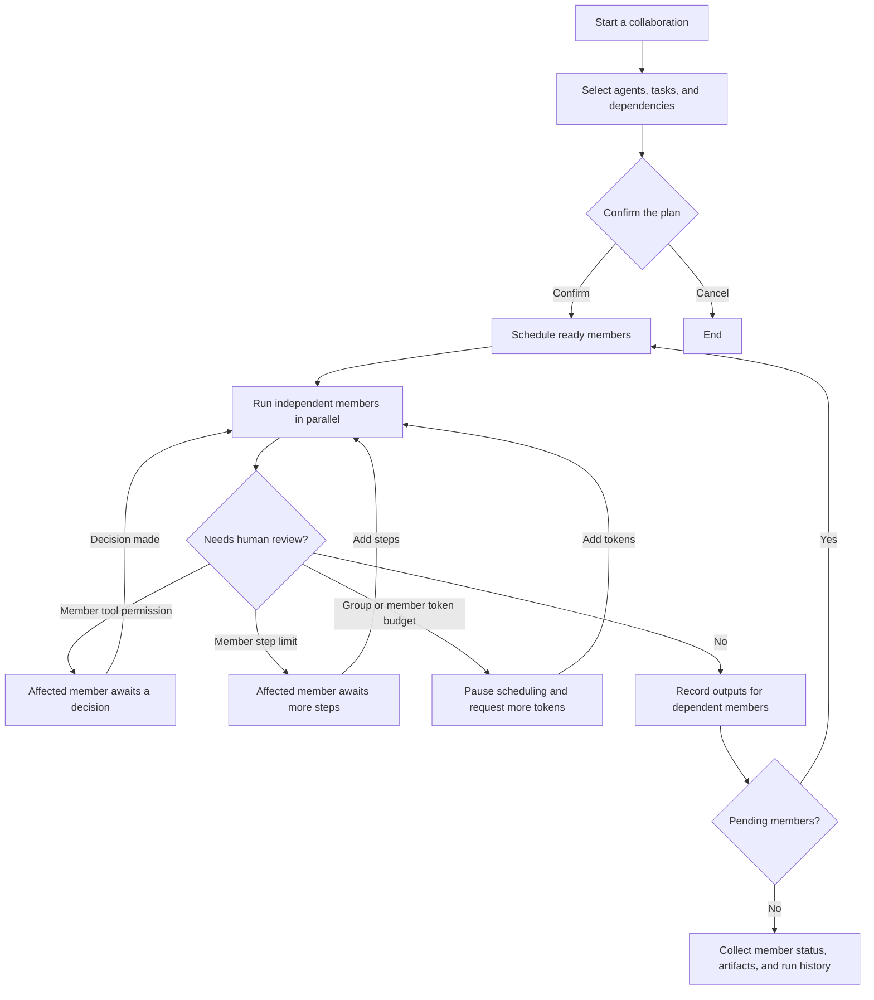
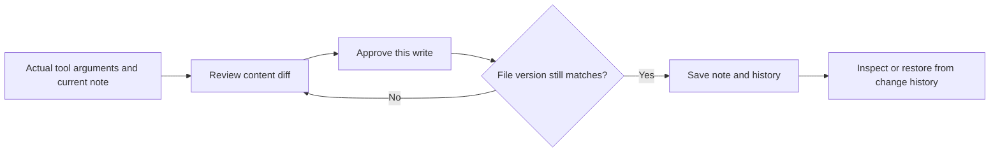
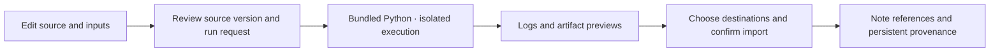
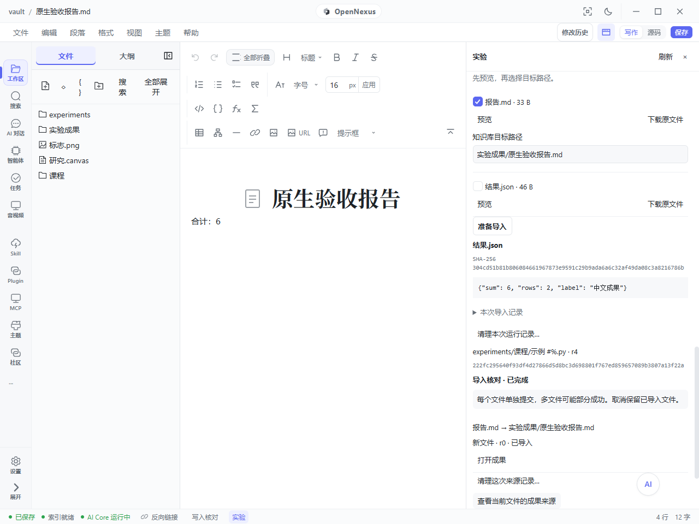
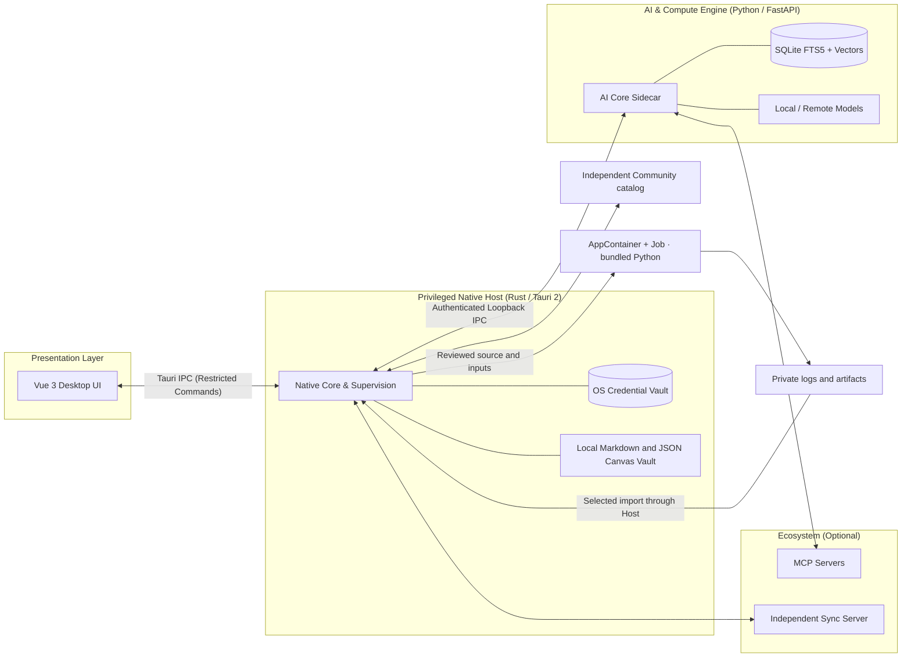
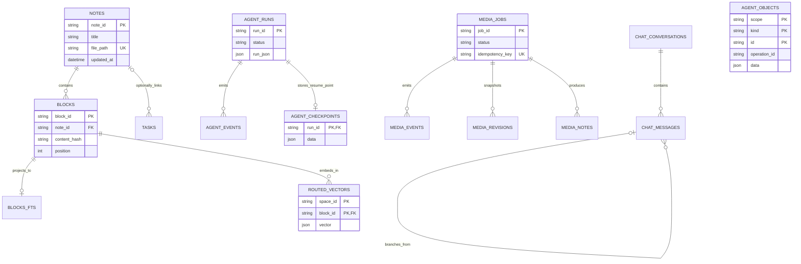

<div align="center">

  

  <h1>OpenNexus</h1>

  <p><strong>The Local-First, AI-Native Knowledge Workspace</strong></p>

  <p>
    Own your data. Ground your AI. Turn scattered media, thoughts, and research into structured, connected knowledge — fully offline or plugged into the models of your choice.
  </p>

  <p>
    <a href="README.zh-CN.md">简体中文</a> •
    <a href="#quick-start">Quick Start</a> •
    <a href="#why-opennexus">Key Features</a> •
    <a href="#architecture">Architecture</a> •
    <a href="#development">Development</a> •
    <a href="https://github.com/KiriAky107/OpenNexus/releases">Releases</a>
  </p>

  <p>
    <a href="https://github.com/KiriAky107/OpenNexus/releases"></a>
    <a href="https://github.com/KiriAky107/OpenNexus/actions/workflows/ci.yml"></a>
    
    
    
    
    <a href="LICENSE"></a>
    
  </p>

</div>

---

Current release: [v0.6.0](https://github.com/KiriAky107/OpenNexus/releases/tag/v0.6.0).

<div align="center">
  
</div>

<table align="center">
  <tr>
    <td width="50%"></td>
    <td width="50%"></td>
  </tr>
  <tr>
    <td width="50%"></td>
    <td width="50%"></td>
  </tr>
  <tr>
    <td width="50%"></td>
    <td width="50%"></td>
  </tr>
  <tr>
    <td width="50%"></td>
    <td width="50%"></td>
  </tr>
  <tr>
    <td width="50%"></td>
    <td width="50%"></td>
  </tr>
  <tr>
    <td colspan="2" align="center"></td>
  </tr>
</table>

---

## What's New in 0.6.0

- **Experiment files and editing**: Create, edit and save Python, JSON and CSV files under the vault’s `experiments/` directory. Renames preserve file identity, note links and artifact provenance.
- **Bundled execution environment**: The installer includes Python 3.13.16. Selected sources and inputs run under AppContainer and Job Object controls, with real output, resource status and cancellation of the entire process tree.
- **Agent experiment workflow**: Review file changes, execution and result import separately. Approval binds the actual source and inputs; retries query recorded outcomes, and chat and collaborative Agents share the same consent records.
- **Results and history**: Preview text, JSON, CSV and images, then choose destinations and overwrite behavior per artifact. Records retain source versions, exit status, truncation details and import receipts, with provenance accessible from notes.
- **Sync updates**: Synchronize retained sources, inputs and artifacts. Inspect file and byte progress, quotas, devices and retry states; review conflict text differences and recover interrupted operations from durable checkpoints.
- **Community updates**: Browse a complete paginated catalog with ETag caching and offline feedback. Review installed package updates, dependencies and permissions; apply personas, experiment templates, MCP configurations and model profiles with transaction recovery.
- **Long responses and code search**: Reuse stable Markdown blocks, apply colors in batches and retain complete copyable source. Tail updates preserve reading position; search ignores hidden copy buffers and corrects result placement after deferred layout.
- **Delivery and operations**: All three repositories use GitHub CI and recoverable publication tools. Desktop packages include WebView2Loader and the experiment runtime; services provide deployment archives, readiness checks, verified backups and restore commands.

## Highlights

- 📁 **Portable Vault Files**: Notes use Markdown, structured maps use JSON Canvas, and referenced images remain ordinary vault files. File moves preserve stable identities and the original extensions.
- 🔍 **Hybrid Local Retrieval**: Combines SQLite FTS5 lexical matching with local vector embeddings using Reciprocal Rank Fusion (RRF) and optional reranking.
- 🎙️ **Media-to-Knowledge**: Turn lecture recordings, podcasts, and meetings into timestamped transcripts, Mermaid diagrams, formulas, and structured notes. Local processing accepts files up to 200 MiB and audio tracks up to two hours.
- 🛡️ **Reviewable AI Writes**: Inspect the actual note diff before approving a write, then browse successful changes and restore a previous revision. Preview approval and restoration both check the current file version.
- 🔎 **Conversation Search**: Find user messages, AI replies, and visible operation summaries in the current conversation; jump to matching text, including earlier answer versions.
- 🔗 **Vault References**: Browse backlinks and unresolved local references. Review every proposed rename or move edit, including changes in long notes; original Markdown formatting, titles, and anchors are preserved.
- 🗂️ **Folder Views**: Open a folder as child-note cards or a list, with real titles, summaries, sorting, filtering, and an optional `index.md` introduction.
- 🧩 **Editable Canvas**: Arrange text, notes, images, URLs, groups, and labeled connections. Pan, zoom, select, copy, undo, and arrange a mind map while preserving imported optional fields.
- 📊 **Persistent Benchmark Comparisons**: Compare completed RAG or Agent runs from the same vault, type, dataset ID, and content hash. Inspect quality, time and cost separately, including individual Agent check regressions; changing run IDs alone does not count as a result change.
- 🤝 **Chat-directed Agent Workflows**: Create reusable or one-off Agents from chat, review multi-Agent plans, and follow reasoning, tool calls, and replies in execution order. Chat-created Agents inherit the selected model when none is specified.
- 🧭 **Focus on the Work**: Hide the main sidebars and editor toolbar with global focus mode; collapse the conversation list and chat settings independently, while user and AI messages remain on opposite sides.
- 🔌 **Extensible Ecosystem**: Built-in support for MCP (Model Context Protocol) servers, custom plugins, and reviewed community packages.
- ⚡ **Strict Local-First Security**: Secrets stay securely stored in the native credential manager. The frontend WebView never touches raw API keys or unrestricted file paths.

---

## Quick Start

### Windows Desktop (Recommended)

1. Download the Windows x64 installer from the [0.6.0 release](https://github.com/KiriAky107/OpenNexus/releases/tag/v0.6.0). For a local build, follow [Packaging](#packaging).
2. *(Optional)* Verify integrity via PowerShell:
```powershell
   Get-FileHash .\OpenNexus_0.6.0_x64-setup.exe -Algorithm SHA256
   # Compare with SHA256SUMS.txt from the same release.

```

3. Run the installer and launch OpenNexus.
4. Select or initialize a directory as your Markdown Vault.
5. Head to **Settings → Model Providers** to connect your preferred local runtime (Ollama, vLLM) or cloud API key.

> The installer includes AI Core. Local model weights and CUDA components can be installed from Settings when needed. Application configuration is persisted under `%APPDATA%\cc.kronecker.notesagent`; existing vaults remain untouched during in-place upgrades.

---

## Core Workflows

### 1. From Recording to Knowledge Note

Transform audio/video into structured notes through a reviewable transcript. Local processing supports files up to 200 MiB and audio tracks up to two hours:


```mermaid
sequenceDiagram
    autonumber
    actor User
    participant UI as Vue Workspace
    participant Host as Tauri (Rust)
    participant Core as AI Core (FastAPI)
    participant ASR as Speech Provider
    participant LLM as Knowledge Model
    participant Vault as Local Vault

    User->>UI: Import Audio / Video
    UI->>Host: Request native file attachment
    Host->>Core: Register media job
    Core->>ASR: Process audio segments & timestamps
    ASR-->>Core: Transcribed stream
    Core-->>UI: Real-time progress events
    User->>UI: Review & edit transcript inline
    User->>UI: Trigger Note Generation
    Core->>LLM: Extract grounded concepts & Mermaid structures
    LLM-->>Core: Validated Markdown output
    Core->>Host: Request atomic note write
    Host->>Vault: Persist Markdown artifact & assets
    Core-->>UI: Ready for review in editor

```

### 2. Controllable & Resumable Agents

Agent runs keep a persistent execution trace. Tool permissions can be reviewed in a dialog or the run card; token and step limits pause execution until the user chooses whether to continue. Saved pause points resume without repeating completed tool operations:


```mermaid
stateDiagram-v2
    [*] --> Queued: Run requested
    Queued --> Running: Worker picks up task
    Running --> AwaitingPermission: Tool operation needs approval
    AwaitingPermission --> Running: User approves or denies this call
    AwaitingPermission --> Cancelled: User stops the run
    Running --> AwaitingContinuation: Token or step limit reached
    AwaitingContinuation --> Running: User adds tokens or steps
    AwaitingContinuation --> Cancelled: User stops the run
    Running --> Completed: Artifact persisted
    Running --> Failed: Error caught & logged
    Running --> Cancelled: Interrupted
    Completed --> [*]
    Failed --> [*]
    Cancelled --> [*]

```

### 3. Multi-Agent Collaboration

From AI Chat or the Agents page, users can combine existing agents and assign tasks and dependencies. Manually created Agents have no token limit by default, with an optional configurable limit; chat-created Agents use the selected conversation model and a token budget. Once the collaboration plan is confirmed, ready members run in parallel, completed outputs feed dependent members, and the results and artifacts are collected in one place:


```mermaid
flowchart TD
    A["Start a collaboration"] --> B["Select agents, tasks, and dependencies"]
    B --> C{"Confirm the plan"}
    C -- Confirm --> D["Schedule ready members"]
    C -- Cancel --> X["End"]
    D --> E["Run independent members in parallel"]
    E --> F{"Needs human review?"}
    F -- Member tool permission --> G["Affected member awaits a decision"]
    F -- Member step limit --> H["Affected member awaits more steps"]
    F -- Group or member token budget --> I["Pause scheduling and request more tokens"]
    G -- Decision made --> E
    H -- Add steps --> E
    I -- Add tokens --> E
    F -- No --> J["Record outputs for dependent members"]
    J --> K{"Pending members?"}
    K -- Yes --> D
    K -- No --> L["Collect member status, artifacts, and run history"]

```

---

### 4. Review and Restore Note Changes

AI note creation, replacement, and Markdown patches show the target and the actual content changes before approval. If the file changes after the preview, review it again before writing. Open **Change history** from the note editor to inspect successful writes or restore the content before a selected change. Restoration creates another history entry and checks that subsequent edits will be preserved.

If a write times out or its history cannot be saved, open **Reconcile writes** in the status bar to inspect pending operations in the current vault. Reconciliation matches the original planned content against durable Host receipts and completes history without writing the note again. Missing or mismatched receipts and legacy records lacking evidence remain uncertain. Later manual edits, moves, and deletions are preserved and are never attributed to the AI output.


```mermaid
flowchart LR
    A[Actual tool arguments and current note] --> B[Review content diff]
    B --> C[Approve this write]
    C --> D{File version still matches?}
    D -- Yes --> E[Save note and history]
    D -- No --> B
    E --> F[Inspect or restore from change history]
```

### 5. Explore a Vault and Compare Results

Select a folder for its introduction and direct child notes. Click **Backlinks** beside the AI Core status in the bottom bar to open a dialog with incoming references and broken vault links. Reference entries locate their source note or Canvas node; review proposed reference edits before moving files.

A `.canvas` file opens in the visual editor. Toggle **Nodes and properties** to show or hide the right inspector; this choice is remembered. **More canvas actions (···)** contains copy, paste, deletion, mind-map layout, and **View JSON source**. The mind-map command changes the layout and can be undone.

On desktop, the title bar identifies the current file, while Save and Markdown editing modes sit beside the application menus. Extension commands are available under **Edit → Extension commands**.

Search a saved conversation to locate a message or visible operation. In **Benchmark**, import a dataset for the current vault, run it more than once, and select a baseline and candidate under **Run comparison**. Comparable runs must be completed and share their dataset content hash; unavailable metrics stay missing. Run records and reports survive app restarts.

The comparison separates quality from time and cost. **Regressions only** includes individual failed Agent checks even when both runs failed overall. Expand a case to inspect its original evidence and configuration differences. Use **Refresh** to discover runs completed elsewhere when this page has no active run.

---

### 6. From Source Files to Experiment Results

1. Copy the [example source](examples/experiments/summary.py), [CSV input](examples/experiments/inputs/data.csv) and [JSON settings](examples/experiments/inputs/settings.json) into `experiments/demo/` in your vault, preserving the directory structure.
2. Open `summary.py`, select **Experiments** in the bottom bar, and choose both inputs. Review the source, inputs, environment and resource settings, then confirm execution separately.
3. Inspect real output, exit status and artifacts. Preview `results/summary.json`, `results/summary.csv` and `results/report.md`, then select an import destination for each result.
4. Open the imported report and its provenance from history or notes. AI can prepare files and requests; file writes, execution and import each have their own review.


```mermaid
flowchart LR
    Edit[Edit source and inputs] --> Review[Review source version and run request]
    Review --> Run[Bundled Python · isolated execution]
    Run --> Output[Logs and artifact previews]
    Output --> Import[Choose destinations and confirm import]
    Import --> Note[Note references and persistent provenance]
```

<div align="center"></div>

## Architecture

OpenNexus adopts a modular, three-tier architecture ensuring clean security boundaries and minimal IPC overhead:


```mermaid
flowchart LR
    subgraph Frontend["Presentation Layer"]
        UI[Vue 3 Desktop UI]
    end

    subgraph Host["Privileged Native Host (Rust / Tauri 2)"]
        HOST[Native Core & Supervision]
        CRED[(OS Credential Vault)]
        VAULT[Local Markdown and JSON Canvas Vault]
    end

    subgraph Core["AI & Compute Engine (Python / FastAPI)"]
        CORE[AI Core Sidecar]
        INDEX[(SQLite FTS5 + Vectors)]
        LLM[Local / Remote Models]
    end

    subgraph External["Ecosystem (Optional)"]
        MCP[MCP Servers]
        SYNC[Independent Sync Server]
    end

    UI <-->|"Tauri IPC (Restricted Commands)"| HOST
    HOST <-->|Authenticated Loopback IPC| CORE
    HOST --- CRED
    HOST --- VAULT
    CORE --- INDEX
    CORE --- LLM
    CORE <--> MCP
    HOST <--> SYNC
    HOST -->|Reviewed source and inputs| RUN[AppContainer + Job · bundled Python]
    RUN --> OUTPUT[Private logs and artifacts]
    OUTPUT -->|Selected import through Host| HOST
    HOST <--> CATALOG[Independent Community catalog]

```

### Responsibility & Trust Boundaries

| Boundary | Technology | Responsibilities | Security Guarantee |
| --- | --- | --- | --- |
| **Presentation** | Vue 3 + Tailwind | Editor, chat UI, agent monitoring, settings | No access to raw secrets or unrestricted disk |
| **Native Host** | Tauri 2 (Rust) | OS integration, process supervisor, keychain | Strict path boundary checking for all FS operations |
| **AI Core** | FastAPI (Sidecar) | RAG pipeline, ASR, agent loops, embeddings | Authenticated local loopback only |
| **Vault** | Local Files | Portable Markdown notes and attachments | User-owned local directory |

OpenNexus cleanly separates user data from application caches. Reusable Agent definitions, collaboration plans, and review records live in vault-scoped `agent_objects`; runs retain configuration snapshots, while `agent_checkpoints` hold paused continuation points:


```mermaid
erDiagram
    NOTES ||--o{ BLOCKS : contains
    BLOCKS ||--o| BLOCKS_FTS : projects_to
    BLOCKS ||--o{ ROUTED_VECTORS : embeds_in
    NOTES o|--o{ TASKS : optionally_links
    AGENT_RUNS ||--o{ AGENT_EVENTS : emits
    AGENT_RUNS ||--o| AGENT_CHECKPOINTS : stores_resume_point
    MEDIA_JOBS ||--o{ MEDIA_EVENTS : emits
    MEDIA_JOBS ||--o{ MEDIA_REVISIONS : snapshots
    MEDIA_JOBS ||--o{ MEDIA_NOTES : produces
    CHAT_CONVERSATIONS ||--o{ CHAT_MESSAGES : contains
    CHAT_MESSAGES o|--o{ CHAT_MESSAGES : branches_from

    NOTES {
        string note_id PK
        string title
        string file_path UK
        datetime updated_at
    }
    BLOCKS {
        string block_id PK
        string note_id FK
        string content_hash
        int position
    }
    ROUTED_VECTORS {
        string space_id PK
        string block_id PK, FK
        json vector
    }
    AGENT_RUNS {
        string run_id PK
        string status
        json run_json
    }
    AGENT_OBJECTS {
        string scope PK
        string kind PK
        string id PK
        string operation_id
        json data
    }
    AGENT_CHECKPOINTS {
        string run_id PK, FK
        json data
    }
    MEDIA_JOBS {
        string job_id PK
        string status
        string idempotency_key UK
    }

```

---

## Ecosystem Repositories

Companion releases: OpenNexus **0.6.0**, Sync for OpenNexus **0.6.0**, and Community for OpenNexus **0.6.0**. Sync uses `/sync/v1`; Community uses `/catalog/v1`. Product versions and protocol versions are maintained separately.

To keep dependencies clean and packaging predictable, services are maintained in separate repositories:

| Repository | Scope | Stack |
| --- | --- | --- |
| **[OpenNexus](https://github.com/KiriAky107/OpenNexus)** | Desktop Application & AI Core | Tauri 2, Rust, Vue 3, FastAPI |
| **[Sync-for-OpenNexus](https://github.com/KiriAky107/Sync-for-OpenNexus)** | Optional self-hosted sync service | Python / FastAPI, PostgreSQL, S3 |
| **[Community-for-OpenNexus](https://github.com/KiriAky107/Community-for-OpenNexus)** | Plugin catalog, skills, and templates | Static Catalog & Registry |

Sync v1 transfers raw content and paths over HTTPS. Its handshake declares `transport-only`: the service can read stored content, and this is not end-to-end encryption. The desktop checks this wire format before synchronizing and displays the service capability and connection security in Sync settings. HTTP is available only through the explicit HTTP test option.

---

## Development

### Prerequisites

| Runtime | Required Version |
| --- | --- |
| **OS** | Windows 10/11 x64 |
| **Node.js** | `>= 22.0.0` (with `pnpm 10.28.0` via corepack) |
| **Python** | `>= 3.11` (managed via [`uv`](https://github.com/astral-sh/uv)) |
| **Rust** | Current stable toolchain (`x86_64-pc-windows-msvc`) |
| **WebView2** | The installer detects and installs the Microsoft Edge WebView2 Runtime as needed (internet required); the SDK Loader DLL is included with the app |

### 1. Setup Environment

```powershell
# Clone the repository
git clone https://github.com/KiriAky107/OpenNexus.git
cd OpenNexus

# Set up Python AI Core dependencies
cd backend
uv sync --frozen

# Set up Desktop Frontend dependencies
cd ..\frontend
corepack enable
corepack prepare pnpm@10.28.0 --activate
pnpm install --frozen-lockfile

```

### 2. Start Development Servers

```powershell
# Terminal 1, from the repository root: Run AI Core Sidecar
cd backend
uv run python scripts/dev-server.py

# Terminal 2, from the repository root: Run Web Interface
cd frontend
pnpm dev

```

> **Desktop Testing**: To test the complete Tauri host integration, run `pnpm tauri dev` from the `frontend/` directory with sidecar binaries properly staged.

### 3. Run Validation Suite

Ensure all checks pass before submitting pull requests:

```powershell
# Backend verification
cd backend
uv run pytest

# Frontend static analysis & tests
cd ..\frontend
pnpm type-check
pnpm test
pnpm build

# Native host lints & unit tests
cd src-tauri
cargo fmt --check
cargo test --all-targets --features desktop
cargo clippy --all-targets --features desktop -- -D warnings

```

---

## Packaging

Build AI Core, then package it in a Windows NSIS installer from the repository root:

```powershell
uv run --directory backend --group packaging python ../scripts/build-core.py
cd frontend
pnpm desktop:build

```

The output installer will be generated in `frontend/src-tauri/target/release/bundle/nsis/`. The [0.6.0 release](https://github.com/KiriAky107/OpenNexus/releases/tag/v0.6.0) also provides a source archive of its fixed release commit and a SHA-256 list.

Windows installers include the architecture-matched, Microsoft-signed `WebView2Loader.dll` beside `OpenNexus.exe`, resolved from the locked WebView2 SDK before bundling. The WebView2 Runtime installer does not supply this app-side DLL. The embedded bootstrapper installs the Runtime if needed and still requires internet access. To check an extracted installer, run `python scripts/verify-windows-loader.py <extracted-installer-directory>`; this checks the Host/Loader architecture and SDK hash, so an SDK installed on the build machine cannot hide a missing DLL.

[GitHub Actions CI](https://github.com/KiriAky107/OpenNexus/actions/workflows/ci.yml) checks documentation, backend, frontend and Rust on pushes to `main` and pull requests, including Windows file-watcher, rename-identity and sync regressions. The manually triggered [Windows package workflow](https://github.com/KiriAky107/OpenNexus/actions/workflows/windows-rc.yml) builds an MSVC installer with the same bundle configuration and verifies its extracted payload. Unsigned builds need no signing secrets; selecting a signed build requires the configured Windows certificate and Core signing key. Artifacts and verification reports are available on each workflow run.

---

## Security & Privacy

* **Local Computation First**: Vault notes are processed strictly on-device unless external network providers are configured.
* **Credential Protection**: Model keys are stored in the OS Credential Vault; they are never accessible to Web content or stored in `localStorage`.
* **Scoped File Access**: The native host validates every path against the actively mounted vault root. Path traversal escapes are strictly blocked.
* **Vulnerability Reporting**: Found a security issue? Please report it privately through GitHub's [Private Vulnerability Reporting](https://github.com/KiriAky107/OpenNexus/security/advisories/new).

---

## Contributing

We welcome contributions of all scopes! To maintain engineering velocity:

1. **Commit Convention**: Follow [Conventional Commits](https://www.conventionalcommits.org):
* `feat(agent): add tool execution retry logic`
* `fix(editor): prevent cursor jump during markdown table edit`
* `test(media): add regression coverage for corrupted audio chunks`


2. **Atomic Changes**: Keep PRs scoped to one logical concern. Include relevant unit tests and UI screenshots where applicable.
3. **Synchronized Documentation**: Update both `README.md` and `README.zh-CN.md` when proposing developer- or user-facing changes.

See our [Contributing Guide](CONTRIBUTING.md) and [Code of Conduct](CODE_OF_CONDUCT.md) for full details.

---

## License

OpenNexus is licensed under the [MIT License](LICENSE). Third-party dependencies, bundled fonts, and model runtimes remain governed by their respective licenses.
