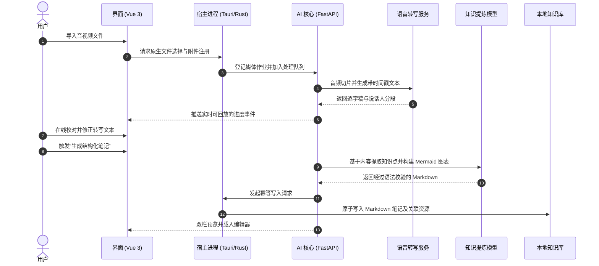
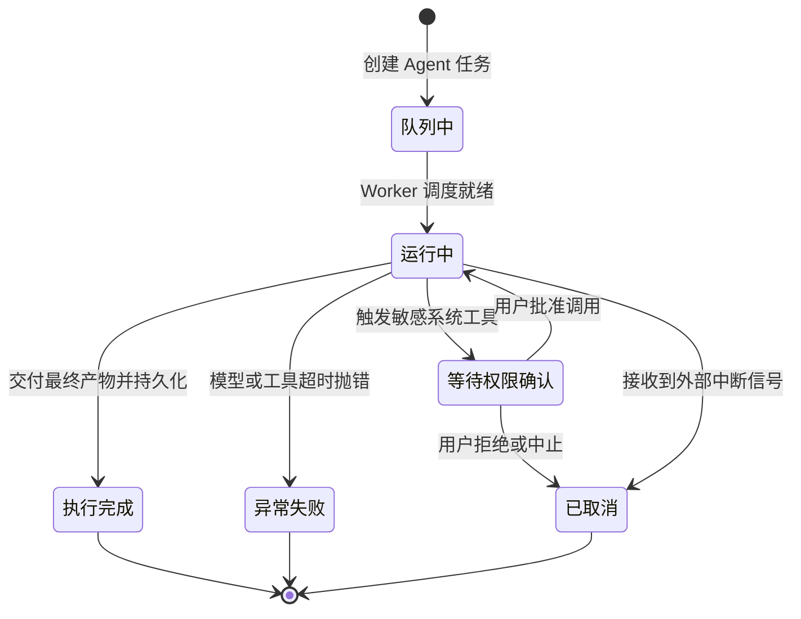
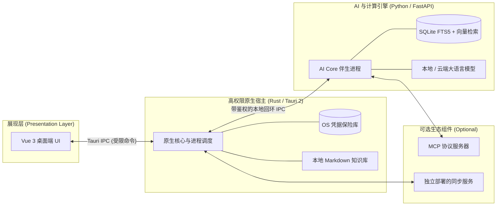
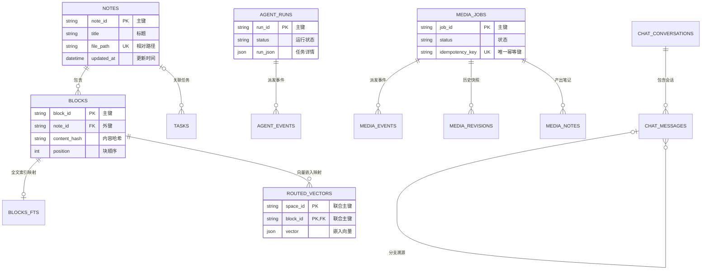

<div align="center">

  

  <h1>OpenNexus</h1>

  <p><strong>本地优先、AI 原生的个人知识工作区</strong></p>

  <p>
    数据自主可控，AI 真实可信。将散落的音视频录音、灵感碎片与深度研究转化为结构化、强关联的本地知识库 —— 支持完全离线运行，亦可按需连接主流云端模型。
  </p>

  <p>
    <a href="README.md">English</a> •
    <a href="#快速开始">快速开始</a> •
    <a href="#核心亮点">核心亮点</a> •
    <a href="#系统架构">系统架构</a> •
    <a href="#本地开发">本地开发</a> •
    <a href="https://github.com/KiriAky107/OpenNexus/releases">发布日志</a>
  </p>
  <p>
    <a href="https://github.com/KiriAky107/OpenNexus/releases/tag/v0.5.6-alpha1"></a>
    
    
    
    
    <a href="LICENSE"></a>
    <a href="visitors"></a>
  </p>

</div>

---

> ⚠️ **Alpha 阶段提示**：OpenNexus 目前处于早期测试阶段（`v0.5.6-alpha1`）。数据存储 Schema、IPC 契约及扩展接口仍可能调整。在升级新版本前，请务必备份关键的 Markdown 知识库（Vault）。

<div align="center">
  
  <p><em>OpenNexus 桌面端工作区：本地 Markdown 库导航、RRF 混合检索以及实时 AI 核心状态监控。</em></p>
</div>
<table align="center">
  <tr>
    <td width="50%"></td>
    <td width="50%"></td>
  </tr>
  <tr>
    <td width="50%"></td>
    <td width="50%"></td>
  </tr>
  <tr>
    <td width="50%"></td>
    <td width="50%"></td>
  </tr>
  <tr>
    <td width="50%"></td>
    <td width="50%"></td>
  </tr>
</table>


---

## 核心亮点

- 📁 **零数据绑定 (Zero Vendor Lock-In)**：笔记采用开放的 Markdown 原生文件存储，辅以相对路径与内容寻址附件。数据随时自由迁移，无私有格式壁垒。
- 🔍 **本地混合检索 (Hybrid Local Retrieval)**：整合 SQLite FTS5 全文搜索与本地向量嵌入（sqlite-vec），引入倒数排名融合（RRF）与可选重排机制（Rerank）。
- 🎙️ **媒体直转知识 (Media-to-Knowledge)**：一键导入课程、会议或播客音视频，生成时间戳对齐的逐字稿，并智能提炼包含 Mermaid 流程图、数学公式的结构化笔记。
- 🛡️ **可审计的自主智能体 (Inspectable Autonomous Agents)**：严格执行人机协同权限授权（Human-in-the-Loop）。所有工具调用、状态流转与执行记录均可回溯与断点恢复。
- 🔌 **标准扩展生态 (Extensible Ecosystem)**：原生接入 MCP (Model Context Protocol) 协议生态，支持经过安全指纹审计的第三方插件与扩展包。
- ⚡ **原生安全边界 (Strict Local-First Security)**：API 密钥统一托管于操作系统凭据管理器（Credential Vault）。前端 WebView 永远无法接触明文凭证或越权访问文件系统。

---

## 快速开始

### Windows 桌面端安装（推荐）

1. 前往 GitHub Releases 下载最新安装包：[`OpenNexus_0.5.6-alpha1_x64-setup.exe`](https://github.com/KiriAky107/OpenNexus/releases/tag/v0.5.6-alpha1)。
2. *(可选)* 通过 PowerShell 校验 SHA-256 完整性：
```powershell
   Get-FileHash .\OpenNexus_0.5.6-alpha1_x64-setup.exe -Algorithm SHA256
   # 预期哈希值: 80E7A1BC489E8CBE19A9B9B5F9189EA1519D78CD2D5756CDA7F9009D7F2F5ACF

```

3. 运行安装程序，在启动界面中选择或新建一个本地文件夹作为 Markdown 知识库（Vault）。
4. 进入 **设置 (Settings) → 模型供应商 (Model Providers)**，配置本地推理后端（如 Ollama、vLLM）或输入云端 API 密钥。

> 安装包采用绿色更新机制，用户应用配置及会话缓存持久化保存在 `%APPDATA%\cc.kronecker.notesagent`，覆盖升级不会影响已存在的本地笔记。

---

## 核心工作流

### 1. 音视频录音转知识笔记

通过可校对的转写中间层，将高噪多媒体平滑提炼为高内聚的知识笔记：



### 2. 受控且可续跑的规划智能体

Agent 的执行具备权限沙箱保障。每次状态转移均通过持久化事件流驱动，网络断开或程序重启不会导致任务状态丢失：



---

## 系统架构

OpenNexus 采用三层解耦架构，严格划分安全信任边界，兼顾本地计算性能与前端交互体验：



### 职责与信任边界划分

| 层次划分 | 核心技术栈 | 主要职责范围 | 安全与隔离保障 |
| --- | --- | --- | --- |
| **视图层 (Frontend)** | Vue 3 + Tailwind | 工作区交互、双模式编辑器、Agent 状态看板、设置中心 | 无明文凭据存储权，无随意读写磁盘权 |
| **宿主层 (Host)** | Tauri 2 (Rust) | 系统级 API 调用、进程生命周期监控、密钥管理、原子文件写入 | 桌面安全中枢，路径严格限制在选定 Vault 内 |
| **计算层 (Core)** | FastAPI (Sidecar) | 混合检索调度、转写封装、Agent 循环、文档导出转换 | 仅监听本地回环地址，依赖宿主鉴权认证 |
| **数据层 (Vault)** | 纯文本生态 | Markdown 笔记文件、内容寻址静态资源、配置元数据 | 100% 用户所属的普通本地文件夹 |

OpenNexus 严格解耦了“用户可读数据”与“索引计算缓存”：



---

## 生态项目

为确保单机版本的纯粹性并降低维护依赖，网络同步与公共服务拆分至独立代码库维护：

| 项目仓库 | 职责定位 | 技术实现 |
| --- | --- | --- |
| **[OpenNexus](https://github.com/KiriAky107/OpenNexus?utm_source=gemini)** | 桌面主程序与内置 AI 核心引擎 | Tauri 2, Rust, Vue 3, FastAPI |
| **[Sync-for-OpenNexus](https://github.com/KiriAky107/Sync-for-OpenNexus?utm_source=gemini)** | 可选的自建端到端加密同步后端 | Rust / Go, PostgreSQL, S3 |
| **[Community-for-OpenNexus](https://github.com/KiriAky107/Community-for-OpenNexus?utm_source=gemini)** | 官方与社区插件、技能、预设模板中心 | 静态托管服务 / 包注册表原型 |

---

## 本地开发

### 环境基线要求

| 运行时环境 | 最低支持版本 |
| --- | --- |
| **操作系统** | Windows 10/11 x64 |
| **Node.js** | `>= 22.0.0`（通过 corepack 启用 `pnpm 10.28.0`） |
| **Python** | `>= 3.11`（推荐通过 [`uv`](https://github.com/astral-sh/uv?utm_source=gemini) 管理） |
| **Rust** | 最新稳定版 Toolchain（带 `x86_64-pc-windows-msvc` target） |
| **WebView2** | 系统预装 Microsoft Edge WebView2 Runtime |

### 1. 环境初始化

```powershell
# 克隆代码仓库
git clone [https://github.com/KiriAky107/OpenNexus.git](https://github.com/KiriAky107/OpenNexus.git)
cd OpenNexus

# 安装 Python AI 核心依赖
cd backend
uv sync --frozen

# 安装前端与桌面框架依赖
cd ..\frontend
corepack enable
corepack prepare pnpm@10.28.0 --activate
pnpm install --frozen-lockfile

```

### 2. 启动开发服务器

```powershell
# 终端 1：启动 AI Core 伴生服务
cd backend
uv run python scripts/dev-server.py

# 终端 2：启动前端 Web 实时预览
cd frontend
pnpm dev

```

> **联调测试**：若要调试原生桌面交互（如原生文件弹窗、系统密钥链等），请在 `frontend/` 目录下执行 `pnpm tauri dev`（需确保后端产物已正确放置于预设 sidecar 目录）。

### 3. 代码质量与测试校验

在提交 PR 之前，请运行完整的静态检查与自动化测试：

```powershell
# 后端测试
cd backend
uv run pytest

# 前端类型检查与构建测试
cd ..\frontend
pnpm type-check
pnpm test
pnpm build

# Rust 宿主端代码格式与 Lint 检查
cd src-tauri
cargo fmt --check
cargo test --all-targets --features desktop
cargo clippy --all-targets --features desktop -- -D warnings

```

---

## 打包发布

在 `frontend/` 目录下执行如下命令构建原生 Windows NSIS 安装程序：

```powershell
cd frontend
pnpm desktop:build

```

构建完成的安装包将输出至 `frontend/src-tauri/target/release/bundle/nsis/`。

---

## 安全与隐私准则

* **本地优先计算**：笔记内容全程保存在本地。除非显式配置并启用了第三方云端模型或同步扩展，否则绝无后台上传行为。
* **敏感凭证防泄漏**：模型提供商 API 密钥交由操作系统凭据安全区保管，杜绝存放在前端 `localStorage` 或代码仓库中。
* **受限沙箱路径**：原生宿主对所有传入的文件操作进行越界校验（Directory Traversal 防御），拒绝访问指定 Vault 以外的任何磁盘路径。
* **安全漏洞汇报**：如发现可利用的安全缺陷，请勿直接公开提 Issue，请通过 [GitHub 私密漏洞上报渠道](https://www.google.com/search?q=https://github.com/KiriAky107/OpenNexus/security/advisories/new&utm_source=gemini) 提交。

---

## 参与贡献

我们欢迎社区各种形式的代码贡献与反馈！为了保证项目的工程演进速度，请遵循以下规范：

1. **Commit 规范**：使用 [Conventional Commits](https://www.conventionalcommits.org/zh-hans/?utm_source=gemini) 提交信息格式：
* `feat(agent): 新增工具调用的自动重试机制`
* `fix(editor): 修复表格编辑模式下的光标跳跃异常`
* `test(media): 补充音视频损坏数据块的容错回归测试`


2. **变更原则**：保持单个 PR 职责单一（Atomic Change）。包含破坏性改动或界面变动时，请附带测试用例或前后效果对比图。
3. **文档同步**：修改涉密协议、配置项或通用交互时，请同步更新 `README.md` 与 `README.zh-CN.md`。

详见 [贡献指南](https://www.google.com/search?q=CONTRIBUTING.md&utm_source=gemini) 与 [行为准则](https://www.google.com/search?q=CODE_OF_CONDUCT.md&utm_source=gemini)。

---

## 开源协议

OpenNexus 核心代码基于 [MIT License](https://www.google.com/search?q=LICENSE&utm_source=gemini) 授权开源。所引用的第三方库、字体、分发运行时以及大语言模型权重遵循其各自独立的开源协议与版权声明。
