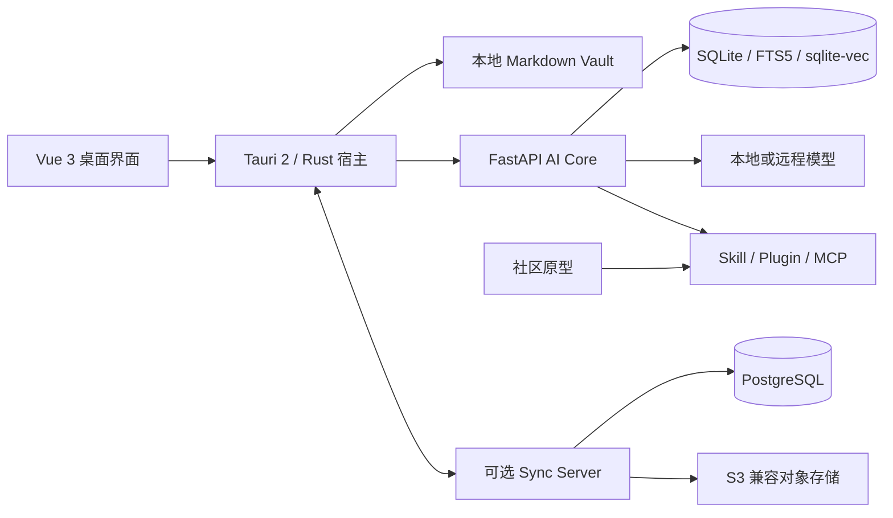

# OpenNexus

**简体中文** | [English](README.md)

[](https://github.com/KiriAky107/OpenNexus/releases/tag/v0.5.2-alpha1)


[](LICENSE)

OpenNexus 是一款本地优先的 AI 笔记与知识工作台，将 Markdown 知识库、混合检索、知识库问答、可审计智能体、音视频转笔记、扩展运行时和可选多设备同步整合在 Windows 桌面应用中。

> 当前版本为 **0.5.2-alpha1**。本版本可用于评估和功能演示，但存储结构与扩展接口仍可能调整。升级前请备份重要知识库。

## 目录

- [项目定位](#项目定位)
- [核心工作流](#核心工作流)
- [系统架构](#系统架构)
- [仓库边界](#仓库边界)
- [安装](#安装)
- [开发环境](#开发环境)
- [配置与数据](#配置与数据)
- [测试](#测试)
- [打包与发布](#打包与发布)
- [安全与隐私](#安全与隐私)
- [参与开发](#参与开发)
- [许可证](#许可证)
- [Issue 要求](#issue-要求)
- [Pull Request 要求](#pull-request-要求)

## 项目定位

OpenNexus 将笔记视为用户拥有的可移植文件，而不是锁定在云端服务中的记录。桌面宿主负责本机高权限操作，AI Core 通过受限的本机接口提供检索、生成、智能体、转写和导出能力。所有远程服务均为可选组件，并可独立部署。

项目设计重点包括：

- **本地所有权**：笔记保持为普通 Markdown 文件，附件使用可迁移的相对路径与内容寻址方式。
- **可追踪 AI**：检索上下文、工具权限、任务状态和 Agent 执行记录均可检查。
- **可替换模型**：可选择本地模型或多个远程提供商，不将知识库绑定到单一厂商。
- **可组合扩展**：Skill、Plugin、主题和 MCP 服务通过清单、权限和信任审查接入。

## 核心工作流

### 课程录音转知识点笔记

导入真实音频或视频，生成带时间戳的转录片段，完成校对后再生成独立的知识点笔记。内容需要时，笔记可包含代码块、数学公式、Mermaid 图和函数图像。转录与笔记生成分为两个阶段，确保原始转录稿始终可核对。

### 个人规划智能体

创建目标导向的 Agent，由其生成计划和可执行任务，仅授权必要工具，并检查完整执行历史。任务状态会持久化，异常中断后可以诊断和恢复，而不是静默丢失。

### 知识工作台

- 使用源码模式或所见即所得模式编辑 Markdown。
- 通过 SQLite FTS5 和向量检索建立索引。
- 使用 RRF 融合与可选精排合并检索结果。
- 针对当前知识库进行有依据的问答。
- 将编辑器快照导出为 PDF、HTML 或 DOCX。
- 将 Markdown 和演示文稿材料整理为可复用笔记。

### 扩展与可选服务

- 在演示时安装 Skill 和 Plugin，不向用户知识库预装扩展包。
- 通过受支持的传输方式连接 MCP；适用时，MCP 进程生命周期与 AI Core 分离管理。
- 安装社区主题和扩展前检查来源、清单与权限。
- 通过独立部署的 Sync Server 同步笔记和附件。

## 系统架构



| 层级 | 职责 | 信任边界 |
| --- | --- | --- |
| Vue 前端 | 工作区、编辑器、搜索、对话、Agent、音视频、扩展和设置界面 | 不直接持久化凭据 |
| Tauri/Rust 宿主 | 文件访问、原生对话框、进程监督、凭据保险库和高权限命令 | 桌面安全边界 |
| FastAPI AI Core | 检索、模型适配器、Agent、转写、索引和导出编排 | 经过认证的本机通道 |
| Vault | Markdown 笔记、附件和本地元数据 | 用户选择的目录 |
| 可选服务 | 同步与社区分发 | 独立仓库和发布周期 |

AI Core 由桌面宿主监督运行，但不负责拥有无关 MCP 进程。生产行为不得依赖仅开发环境可用的 `stdio` 假设。

## 仓库边界

| 路径 | 用途 |
| --- | --- |
| `frontend/` | Vue 3 应用与 Tauri/Rust 桌面宿主 |
| `frontend/src-tauri/` | 原生命令、能力权限、Sidecar 监督和 NSIS 打包配置 |
| `backend/` | FastAPI AI Core、检索、Agent、媒体处理、模型适配器和导出 |
| `backend/tests/` | 后端单元测试和集成测试 |
| `scripts/` | 构建、验收、验证与发布自动化 |
| `tools/` | 开发和打包辅助工具 |

公开组件分别维护：

| 组件 | 仓库 |
| --- | --- |
| 桌面主程序与 AI Core | [KiriAky107/OpenNexus](https://github.com/KiriAky107/OpenNexus) |
| Sync Server | [KiriAky107/Sync-for-OpenNexus](https://github.com/KiriAky107/Sync-for-OpenNexus) |
| 社区原型 | [KiriAky107/Community-for-OpenNexus](https://github.com/KiriAky107/Community-for-OpenNexus) |

本仓库不得混入 Sync Server 或社区服务的部署代码。跨仓库变更需要注明兼容版本，并分别发布。

## 安装

### Windows 安装包

1. 从 [GitHub Release](https://github.com/KiriAky107/OpenNexus/releases/tag/v0.5.2-alpha1) 下载 `OpenNexus_0.5.2-alpha1_x64-setup.exe`。
2. 校验 SHA-256：

   ```powershell
   Get-FileHash .\OpenNexus_0.5.2-alpha1_x64-setup.exe -Algorithm SHA256
   ```

   当前发布安装包的预期值为：

   ```text
   F1B88FDF1D3AE0B48B3D2907818A52B843E39BF94E94B4A913EC6AFD26EC8786
   ```

3. 运行安装程序，从开始菜单启动 OpenNexus，然后选择已有 Markdown 知识库或创建新知识库。
4. 打开“设置 → 模型提供商”，配置本地或远程模型。

安装包不包含用户知识库、已下载模型权重、CUDA 运行时或预装社区包。覆盖安装时会保留当前 Windows 用户位于 `%APPDATA%\cc.kronecker.notesagent` 的应用数据。

## 开发环境

### 环境要求

| 工具 | 支持基线 |
| --- | --- |
| Windows | Windows 10/11 x64 |
| Node.js | 22 或更高版本 |
| pnpm | 10.28.0 |
| Python | 3.11 或更高版本 |
| uv | 0.9.24 或兼容版本 |
| Rust | 当前稳定版工具链及 MSVC 目标 |
| WebView2 | 当前 Microsoft Edge WebView2 Runtime |

媒体处理、本地推理和部分导出路径可能需要额外运行时。仅为需要测试的功能安装这些组件，不要提交模型文件或运行时压缩包。

### 克隆并安装依赖

```powershell
git clone https://github.com/KiriAky107/OpenNexus.git
cd OpenNexus

cd backend
uv sync --frozen

cd ..\frontend
corepack enable
corepack prepare pnpm@10.28.0 --activate
pnpm install --frozen-lockfile
```

依赖锁定文件属于构建契约。修改依赖清单时，必须在同一个 Pull Request 中同步更新锁定文件。

### 启动开发环境

```powershell
# 终端一：AI Core
cd backend
uv run python scripts/dev-server.py

# 终端二：Web 前端
cd frontend
pnpm dev
```

进行桌面集成开发时，在 `frontend/` 中启动 Tauri 开发命令，并准备所需 Sidecar 产物。浏览器开发模式无法覆盖原生对话框、凭据保存、Sidecar 启动和安装路径，因此必须单独测试打包后的桌面应用。

### 常用前端命令

```powershell
cd frontend
pnpm type-check
pnpm test
pnpm build
pnpm build:report
```

## 配置与数据

- Vault 是由用户选择的目录，不属于应用源代码仓库。
- 模型提供商密钥必须保存在桌面凭据保险库中，不得写入源代码、截图、日志、测试夹具或 `localStorage`。
- 索引和生成缓存应当可以重建，不得作为笔记内容的唯一事实来源。
- 远程同步默认关闭。登录前应检查服务地址、TLS 配置、设备名和同步数据范围。
- 扩展包在完成清单、校验值、权限和可执行内容审查前，应视为不可信输入。
- 用于报告问题的日志必须脱敏；可保留必要的关联 ID，但应删除 Vault 正文、凭据、个人路径、主机名和个人信息。

## 测试

提交 Pull Request 前，应运行与改动层级相关的检查：

```powershell
# 后端测试
cd backend
uv run pytest

# 前端测试与生产构建
cd ..\frontend
pnpm test
pnpm type-check
pnpm build

# 原生宿主检查
cd src-tauri
cargo fmt --check
cargo test --all-targets --features desktop
cargo clippy --all-targets --features desktop -- -D warnings
```

跨进程或跨仓库变更还应运行 `scripts/` 下对应的验收脚本，并记录验收场景。发布候选版本至少应覆盖：启动、选择 Vault、模型提供商重启恢复、转录稿生成知识点笔记、Agent 规划、扩展安装、原生保存对话框、PDF/HTML/DOCX 导出，以及可选同步登录。

测试必须可重复，不得依赖贡献者的个人知识库或凭据，并应清理临时进程与文件。

## 打包与发布

在 `frontend/` 目录构建 Windows NSIS 安装包：

```powershell
pnpm desktop:build
```

桌面构建会先执行生产前端构建，并使用 `frontend/src-tauri/tauri.bundle.conf.json`。发布前需要：

1. 同步前端包、Tauri 配置、Rust 包和 Python 包元数据中的版本号。
2. 构建 AI Core Sidecar，确认桌面宿主启动的是匹配版本的产物。
3. 运行前端、后端、Rust 和发行验收检查。
4. 在干净的 Windows 用户环境中安装生成的 setup 程序。
5. 从安装后的应用验证原生文件对话框和 PDF、HTML、DOCX 导出。
6. 计算并发布 SHA-256 校验值。
7. 创建附注版本标签，并发布非草稿 GitHub Release。
8. 确保源码归档不包含 Vault、凭据、个人文档、生成缓存和其他服务仓库。

版本标签采用 `v<版本号>` 格式。Alpha 版本可以在明确说明状态的情况下作为普通 Release 发布，但发行说明必须保留兼容性限制。

## 安全与隐私

- 除非用户主动启用远程模型、同步或其他联网集成，否则 Vault 内容保留在本机。
- 模型凭据由桌面凭据保险库处理，不得由 WebView 持久化。
- 扩展权限、网络访问和高权限工具调用必须经过明确审查与授权。
- 原生命令必须验证路径，不得将文件访问范围扩大到所选 Vault 或用户明确操作之外。
- 只安装来自可信来源的 Skill、Plugin、主题和 MCP 服务。

不要在公开 Issue 中发布可利用的安全细节或真实密钥。请使用维护者私下联系方式，或在启用后使用 GitHub Private Vulnerability Reporting。

## 参与开发

- 每次改动聚焦一个问题，并遵守上述仓库边界。
- 接口变化时，同步更新前端类型、后端 Schema、原生命令和测试。
- 使用锁定依赖，并说明新增运行时依赖的用途、许可证及打包影响。
- 提交信息采用 Conventional Commits，例如：

  ```text
  feat(agent): 持久化中断的规划任务
  fix(export): 修复安装版 PDF 渲染
  test(media): 覆盖转录稿生成知识点笔记
  docs(readme): 补充 Windows 发行校验说明
  ```

- 公共说明发生变化时，同时更新 `README.md` 和 `README.zh-CN.md`。
- 不得提交用户 Vault、个人文档、凭据、模型权重、构建产物或能识别参赛身份的材料。

## 许可证

OpenNexus 项目代码采用 [MIT License](LICENSE)。随项目分发或由用户下载的模型、程序库、字体、图标及其他第三方组件继续适用各自的许可证与声明；项目的 MIT 许可证不会覆盖或替代这些条款。

## Issue 要求

提交 Issue 前：

1. 搜索已开启和已关闭的 Issue，确认问题尚未被记录。
2. 使用具体标题，并注明是缺陷、功能建议、文档问题还是兼容性咨询。
3. 缺陷报告必须提供 OpenNexus 版本或提交号、Windows 版本、安装方式、受影响组件、预期结果、实际结果和最小复现步骤。
4. 仅附上定位问题所需的截图或日志，并删除 API Key、Token、Vault 正文、个人路径、账户信息、主机名和个人信息。
5. 说明问题出现在打包后的桌面应用、Web 开发模式，还是两者均可复现。
6. 提供相关模型/Provider、扩展、MCP 传输方式和 Sync Server 版本，但不得暴露凭据。
7. 安全漏洞和已经泄露的密钥必须私下报告，不得提交公开 Issue。

只有“无法使用”等笼统描述、缺少复现信息、重复提交或包含隐私数据的 Issue，可能会在补充或修正前被关闭。

## Pull Request 要求

Pull Request 必须满足：

1. 关联对应 Issue，或清楚说明改动动机和用户可见结果。
2. 只包含一个便于审查的逻辑改动；无关重构与生成文件必须拆分。
3. 从功能分支提交并使用 Conventional Commits；不得重写其他贡献者的分支，也不得强制更新默认分支。
4. 行为变化必须包含测试，并列出实际通过的命令和验收场景。
5. 同步更新两种语言的公共文档；行为、配置或兼容性变化还需更新发行说明。
6. 说明前端/后端/原生接口变化、数据迁移、回滚行为和跨仓库版本要求。
7. 说明每个新增依赖的用途、许可证、运行时体积和安装包影响。
8. UI 变更需提供前后对比截图，并删除全部个人信息和敏感信息。
9. 不得包含凭据、私人 Vault、个人文档、已下载模型、构建产物或能识别参赛身份的材料。
10. 请求审查前，应通过格式检查、类型检查、测试、生产构建和适用的桌面安装版验收。

欢迎使用 Draft Pull Request 进行早期技术讨论。仅在检查清单完成，且审查者无需访问私人基础设施或个人数据即可复现时，才应将 Pull Request 标记为 Ready for review。
