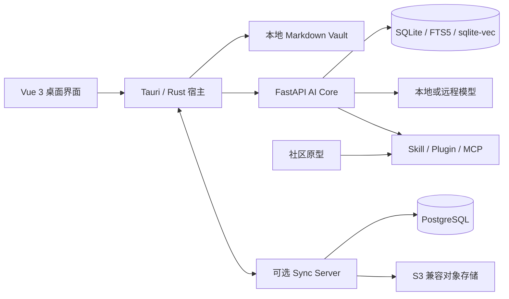

# OpenNexus

**简体中文** | [English](README.md)


OpenNexus 是一款本地优先的 AI 笔记与知识工作台，将 Markdown 知识库、混合检索、知识库问答、可审计智能体、音视频转笔记、扩展系统和可选的多设备同步整合在同一个桌面应用中。

> 当前版本：**0.5.2-alpha1**。升级 Alpha 版本前，请先备份重要知识库。

## 核心能力

- **真实课程录音转笔记**：转写音频或视频，校对带时间戳的文本，并生成知识点笔记；必要时可加入代码块、Mermaid 图、公式和函数图像。
- **个人规划智能体**：创建目标导向的 Agent，生成计划与任务，控制工具权限，并查看完整执行轨迹。
- **本地优先知识库**：编辑 Markdown、管理附件，并结合 SQLite FTS5、向量检索、RRF 融合和轻量精排。
- **多模型提供商**：支持 OpenAI、Anthropic、Ollama、DeepSeek 和 OpenAI 兼容接口，凭据不写入 WebView。
- **可扩展工作台**：安装 Skill、Plugin、主题和 MCP 集成，并进行明确的权限确认与信任审查。
- **多格式导出**：将笔记导出为 PDF、HTML 和 DOCX；工作区图片采用内容寻址的相对路径。
- **可选远程同步**：在设备之间同步笔记和附件，提供冲突预览、修订历史和设备撤销。

## 系统架构



桌面宿主管理本地文件、凭据、进程监督和扩展的特权操作。AI Core 作为受监督的独立进程，通过经过认证的本机通道通信。Sync Server 与社区原型均为可选组件。Gitea 发布镜像继续使用单体仓库，公开的 GitHub 项目则分别维护。

## 仓库结构

| 路径 | 用途 |
| --- | --- |
| `frontend/` | Vue 3 界面与 Tauri/Rust 桌面宿主 |
| `backend/` | FastAPI AI Core、检索、Agent、媒体处理和导出 |
| `server sync/` | Sync v1 服务及 Vue 管理控制台 |
| `community-server/` | 社区目录与审核原型 |
| `scripts/` | 构建、验收与发布自动化 |
| `tools/` | 本地开发和打包工具 |

## 公开仓库

| 组件 | GitHub 仓库 |
| --- | --- |
| 桌面主程序与 AI Core | [KiriAky107/OpenNexus](https://github.com/KiriAky107/OpenNexus) |
| Sync Server | [KiriAky107/Sync-for-OpenNexus](https://github.com/KiriAky107/Sync-for-OpenNexus) |
| 社区原型 | [KiriAky107/Community-for-OpenNexus](https://github.com/KiriAky107/Community-for-OpenNexus) |

Gitea 分发仓库保留单体结构，便于从同一修订构建和演示完整版本；GitHub 将三个可独立部署的组件拆分到不同仓库。

## 安装桌面端

1. 从 [v0.5.2-alpha1 发布页](https://gitea.kronecker.cc/Kronecker/NotesAgentic/releases/tag/v0.5.2-alpha1)下载 `OpenNexus_0.5.2-alpha1_x64-setup.exe`。
2. 核对发布的 SHA-256 校验值。
3. 运行安装程序，并从开始菜单启动 OpenNexus。
4. 选择已有 Markdown 知识库或创建新知识库。
5. 在“设置 → 模型提供商”中配置本地或远程模型。

安装包不包含用户知识库、已下载模型权重、CUDA 运行时或预装社区包。同一 Windows 用户升级安装时，会继续使用 `%APPDATA%\cc.kronecker.notesagent` 中的已有配置和索引。

## 开发环境

### 环境要求

| 工具 | 版本 |
| --- | --- |
| Node.js | 22+ |
| pnpm | 10.28.0 |
| Python | 3.12+ |
| uv | 0.9.24 |
| Rust | stable |

安装依赖：

```powershell
cd backend
uv sync --frozen

cd ../frontend
corepack enable
corepack prepare pnpm@10.28.0 --activate
pnpm install --frozen-lockfile
```

启动 Web 开发环境：

```powershell
# 终端一：AI Core
cd backend
uv run python scripts/dev-server.py

# 终端二：前端
cd frontend
pnpm dev
```

构建 Windows 桌面应用：

```powershell
cd frontend
pnpm desktop:build
```

## 运行测试

```powershell
# 后端
cd backend
uv run pytest

# 前端
cd ../frontend
pnpm test
pnpm type-check
pnpm build

# Rust 宿主
cd src-tauri
cargo fmt --check
cargo test --all-targets --features desktop
cargo clippy --all-targets --features desktop -- -D warnings

# Sync Server
cd "../../../server sync"
uv sync --frozen
uv run pytest
```

## 部署 Sync Server

推荐使用 Docker Compose、PostgreSQL 和 S3 兼容对象存储：

```powershell
cd "server sync"
Copy-Item .env.example .env
docker compose up -d --build
```

正式环境应使用独立密钥、TLS 终止、进程守护和定期备份。明文 HTTP 选项仅用于隔离的演示与本地测试。

## 安全与隐私

- 除非用户主动启用远程模型、同步或其他联网集成，否则 Vault 内容保留在本地。
- 模型凭据由桌面凭据保险库保存，不持久化到前端 `localStorage`。
- 扩展权限、网络访问和高权限工具调用均需经过授权。
- 日志和问题报告不得包含 Vault 正文、访问令牌、模型密钥或个人信息。
- 只安装来自可信来源的 Skill、Plugin、主题和 MCP 服务。

安全问题应私下联系仓库维护者，不要在公开 Issue 中提交敏感细节。

## 参与开发

请使用锁定版本的依赖，保持前后端契约同步，并在提交前运行相关测试。提交信息采用 Conventional Commits，例如：

```text
feat(sync): 增加设备撤销功能
fix(export): 修复打包版本的 PDF 渲染
test(agent): 覆盖任务中断恢复流程
```

OpenNexus 目前仍处于 Alpha 阶段。问题报告应包含应用版本、操作系统、复现步骤和脱敏后的关联 ID。

## 许可证

OpenNexus 项目代码采用 [MIT License](LICENSE)。随项目分发的模型、程序库、字体、图标及其他第三方组件继续适用各自的许可证与声明；项目的 MIT 许可证不会覆盖或替代这些条款。
