<div align="center">

  

  <h1>OpenNexus</h1>

  <p><strong>本地优先、AI 原生的个人知识工作区</strong></p>

  <p>
    数据自主可控，AI 真实可信。将散落的音视频录音、灵感碎片与深度研究转化为结构化、强关联的本地知识库 —— 支持完全离线运行，亦可按需连接主流云端模型。
  </p>

  <p>
    <a href="README.md">English</a> •
    <a href="#快速开始">快速开始</a> •
    <a href="#核心亮点">核心亮点</a> •
    <a href="#系统架构">系统架构</a> •
    <a href="#本地开发">本地开发</a> •
    <a href="https://github.com/KiriAky107/OpenNexus/releases">发布日志</a>
  </p>
  <p>
    <a href="https://github.com/KiriAky107/OpenNexus/releases"></a>
    <a href="https://github.com/KiriAky107/OpenNexus/actions/workflows/ci.yml"></a>
    
    
    
    
    <a href="LICENSE"></a>
    
  </p>

</div>

---

当前版本：[v0.5.9-beta2](https://github.com/KiriAky107/OpenNexus/releases/tag/v0.5.9-beta2)。

<div align="center">
  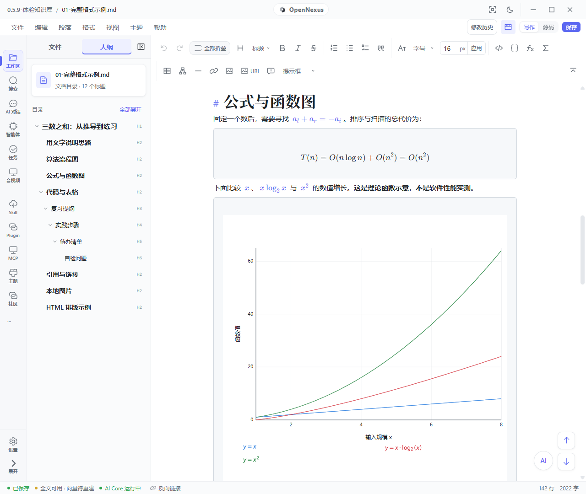
</div>
<table align="center">
  <tr>
    <td width="50%">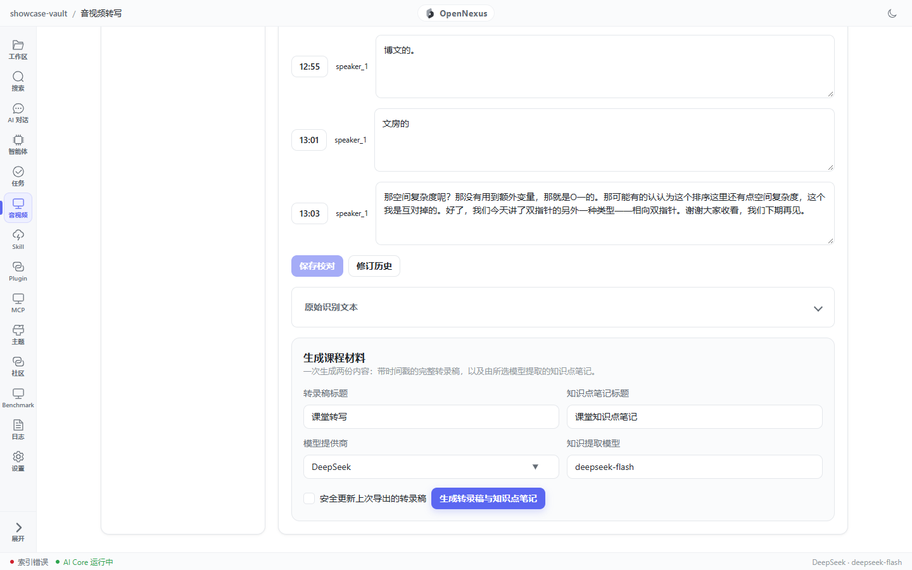</td>
    <td width="50%">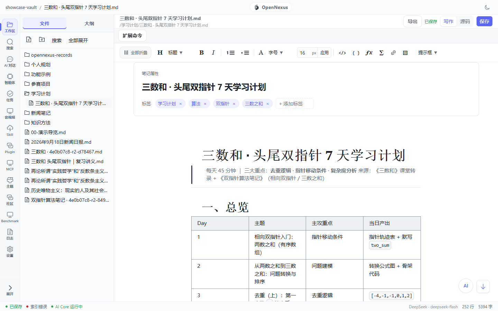</td>
  </tr>
  <tr>
    <td width="50%">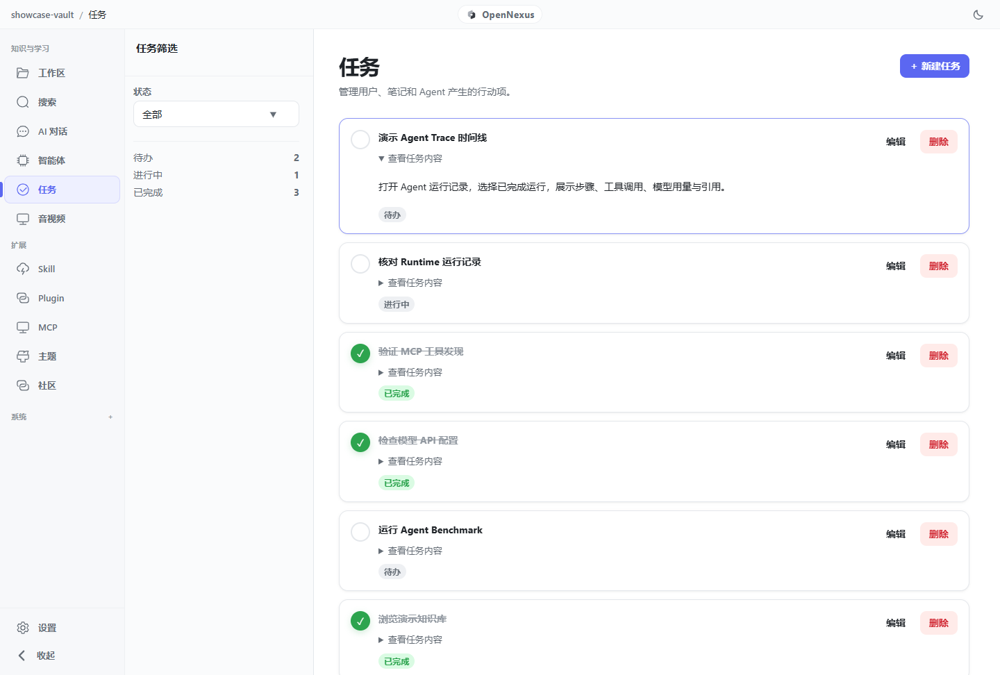</td>
    <td width="50%">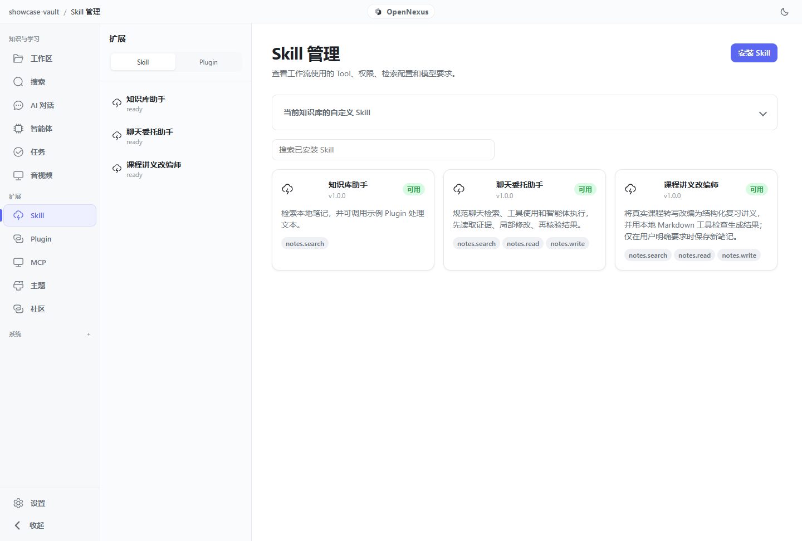</td>
  </tr>
  <tr>
    <td width="50%">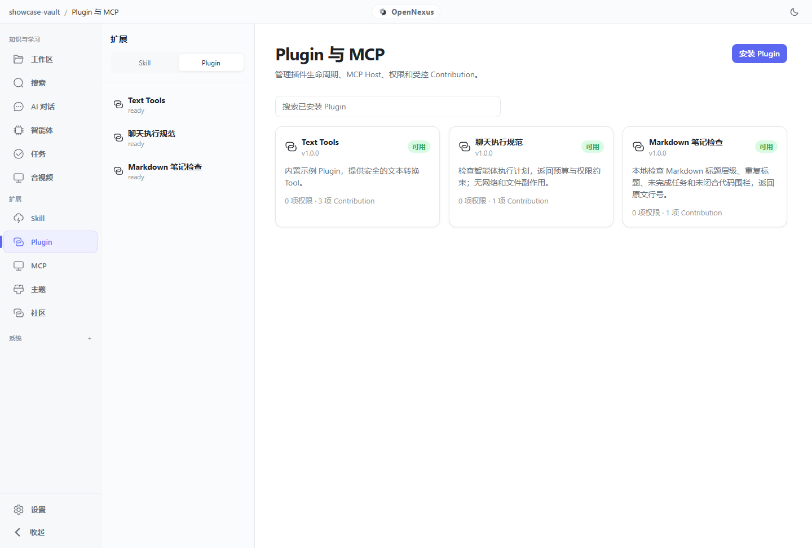</td>
    <td width="50%">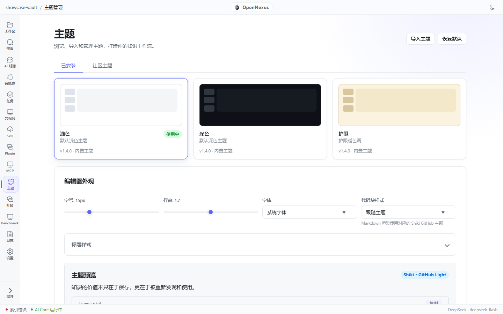</td>
  </tr>
  <tr>
    <td width="50%">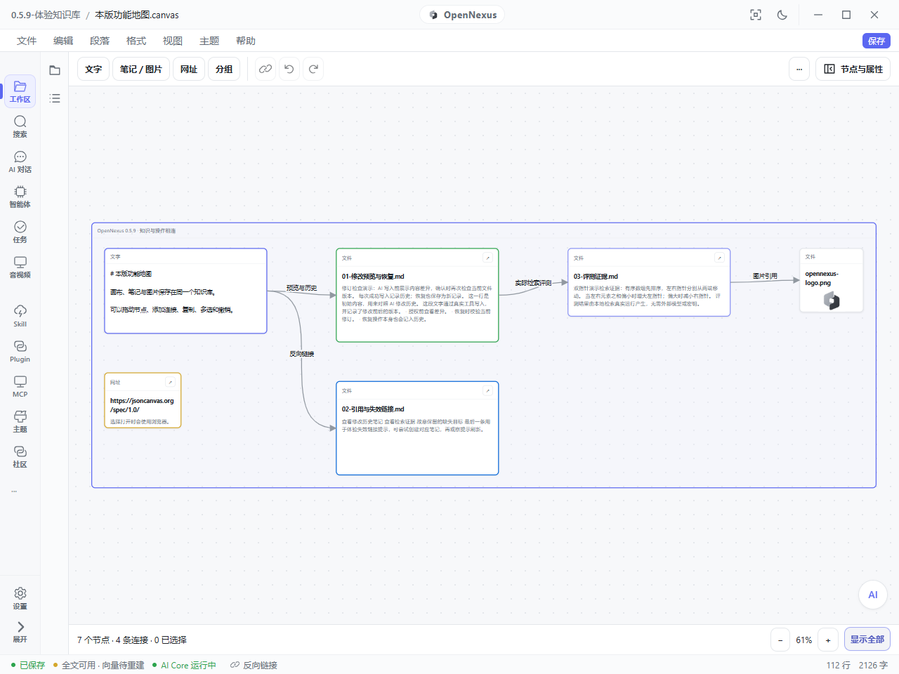</td>
    <td width="50%">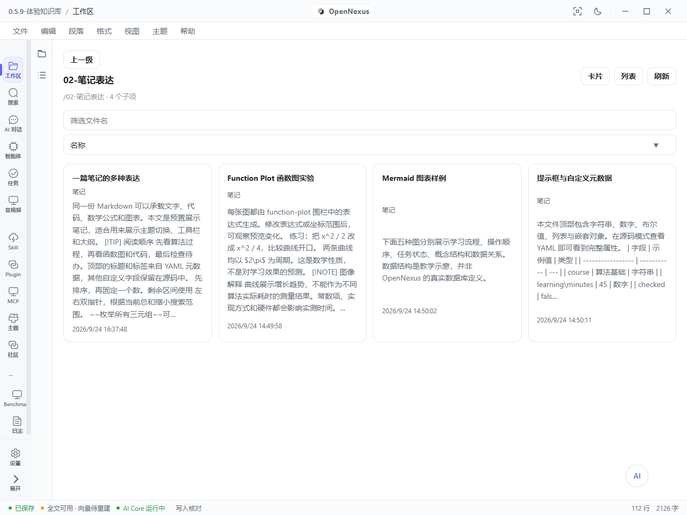</td>
  </tr>
  <tr>
    <td width="50%">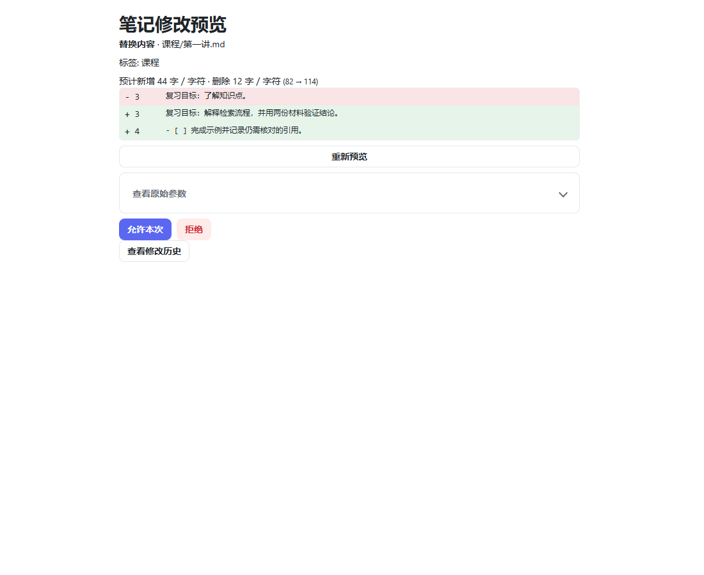</td>
    <td width="50%">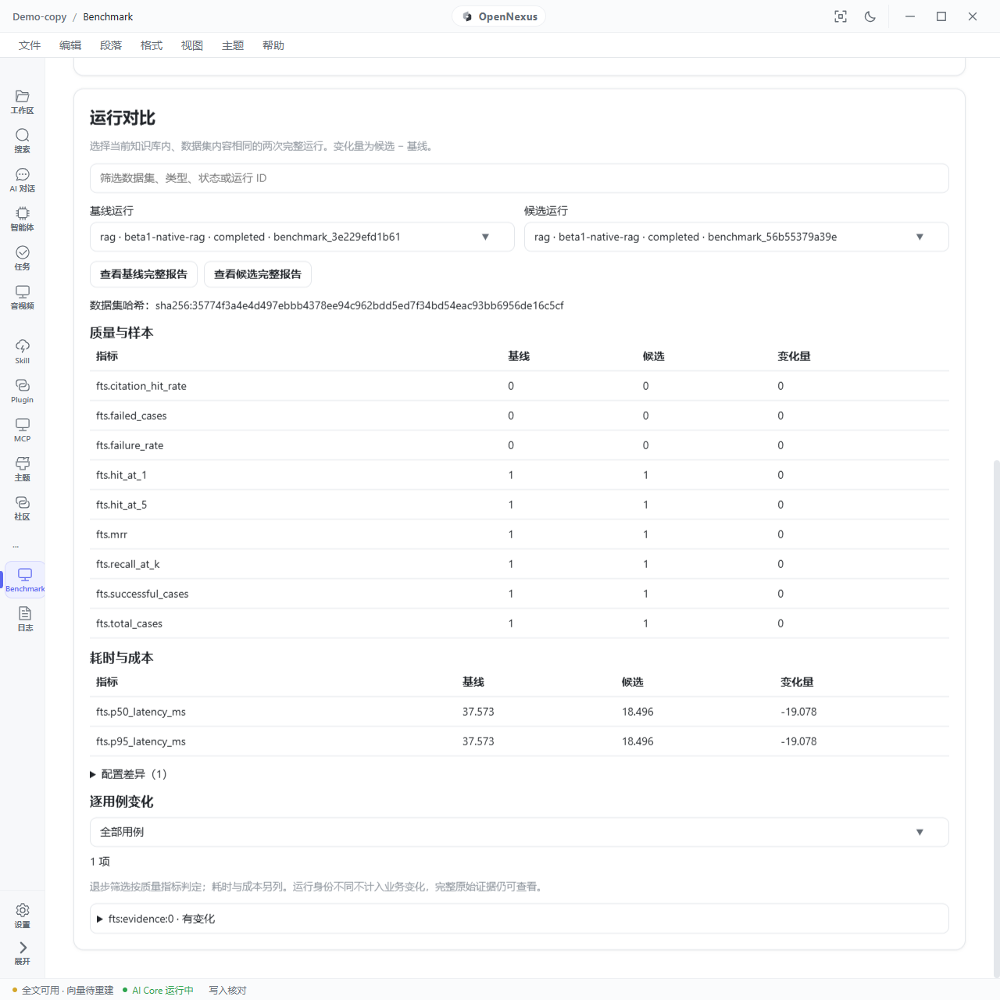</td>
  </tr>
  <tr>
    <td colspan="2" align="center">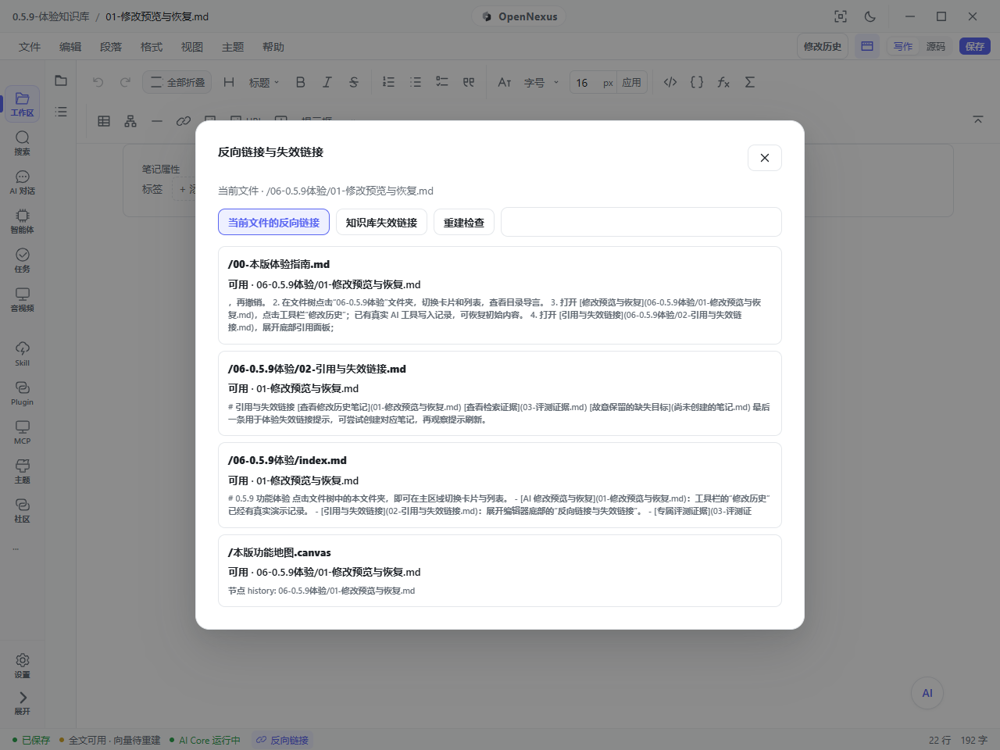</td>
  </tr>
</table>


---

## 0.5.9-beta2 更新

- **正文链接、AI 引用与搜索**：兼容不同路径格式，在两种编辑器中定位实际引用段落；段落发生变化时明确提示。
- **编辑与外部更新**：保留文件切换和保存期间的输入，外部正文读取中断后继续重试，未保存内容仍受冲突检查保护。
- **外部重命名与同步**：大小写改名、连续改名与文件名交换时保留文件身份，中断后继续执行已保存的同步队列。
- **画布文件路径**：正确打开和预览名称含字面 `#`、`%` 的文件，改名时保留独立标题定位及自引用。
- **聊天收尾**：保持并发分支一致，结束被中断的工具状态；回复在后台保存，退出时等待完成，保存失败时显示提示。
- **Benchmark 写入**：数据集只保存一次，逐条追加样本结果与进度，减少重复写入，同时保留报告与重启恢复。
- **代码块与流式预览**：语法高亮转入后台 Worker，合并频繁预览更新并复用未变化代码块，新文本及时显示。
- **发布检查**：GitHub CI 检查中英文更新说明、版本一致性与下载链接。

## 核心亮点

- 📁 **开放的知识库文件**：笔记使用 Markdown，结构化画布使用 JSON Canvas，引用的图片仍是普通知识库文件。移动文件保留稳定身份与真实扩展名。
- 🔍 **本地混合检索 (Hybrid Local Retrieval)**：整合 SQLite FTS5 全文搜索与本地向量嵌入（sqlite-vec），引入倒数排名融合（RRF）与可选重排机制（Rerank）。
- 🎙️ **媒体直转知识 (Media-to-Knowledge)**：一键导入课程、会议或播客音视频，生成时间戳对齐的逐字稿，并智能提炼包含 Mermaid 流程图、数学公式的结构化笔记。本地处理支持最大 200 MiB 的文件与最长两小时的音轨。
- 🛡️ **AI 写入审核与恢复**：授权前查看实际笔记差异，写入后浏览修改历史并恢复先前版本。预览确认与恢复都会核对当前文件版本。
- 🔎 **对话内搜索**：搜索当前会话中的用户正文、AI 回复和可见操作摘要，定位并高亮命中内容，也能跳转到旧的回答版本。
- 🔗 **知识库引用检查**：查看反向链接与失效的本地引用。改名、移动前逐处审核建议改写，包括长笔记中的修改；保留原有 Markdown 格式、标题与锚点。
- 🗂️ **文件夹子笔记视图**：以卡片或列表浏览真实标题、摘要与更新时间，支持排序、筛选及可选的 `index.md` 导言。
- 🧩 **可编辑画布**：编排文字、笔记、图片、网址、分组和带标签的连线。支持平移、缩放、多选、复制、撤销与思维导图布局，保留导入文件中的未知可选字段。
- 📊 **持久化评测对比**：比较当前知识库内同类型、同数据集 ID 与内容哈希的完整 RAG 或 Agent 运行；分别查看质量、耗时成本与 Agent 单项检查退步，仅运行 ID 不同不计为结果变化。
- 🤝 **对话驱动的智能体协作**：可在对话中创建可复用或临时智能体，审核多智能体分工，并按发生顺序查看思考、工具调用与回复；未指定模型时，对话创建的智能体沿用当前模型。
- 🧭 **全局专注模式**：一键收起主侧栏和编辑工具栏；对话列表与顶部设置可分别折叠，用户和 AI 消息分列显示，让内容成为界面焦点。
- 🔌 **标准扩展生态 (Extensible Ecosystem)**：原生接入 MCP (Model Context Protocol) 协议生态，支持经过安全指纹审计的第三方插件与扩展包。
- ⚡ **原生安全边界 (Strict Local-First Security)**：API 密钥统一托管于操作系统凭据管理器（Credential Vault）。前端 WebView 永远无法接触明文凭证或越权访问文件系统。

---

## 快速开始

### Windows 桌面端安装（推荐）

1. 前往 [0.5.9-beta2 Release](https://github.com/KiriAky107/OpenNexus/releases/tag/v0.5.9-beta2) 下载 Windows x64 安装包。本地构建可按[打包发布](#打包发布)步骤进行。
2. *(可选)* 通过 PowerShell 校验 SHA-256 完整性：
```powershell
   Get-FileHash .\OpenNexus_0.5.9-beta2_x64-setup.exe -Algorithm SHA256
   # 与同一 Release 中的 SHA256SUMS.txt 比对。

```

3. 运行安装程序，在启动界面中选择或新建一个本地文件夹作为 Markdown 知识库（Vault）。
4. 进入 **设置 (Settings) → 模型供应商 (Model Providers)**，配置本地推理后端（如 Ollama、vLLM）或输入云端 API 密钥。

> 安装包自带 AI Core，本地模型权重与 CUDA 组件可按需在设置中安装。用户应用配置及会话缓存保存在 `%APPDATA%\cc.kronecker.notesagent`，覆盖升级不会影响已存在的本地笔记。

---

## 核心工作流

### 1. 音视频录音转知识笔记

通过可校对的转写中间层，将音视频素材整理成结构化知识笔记。本地处理支持最大 200 MiB 的文件与最长两小时的音轨：

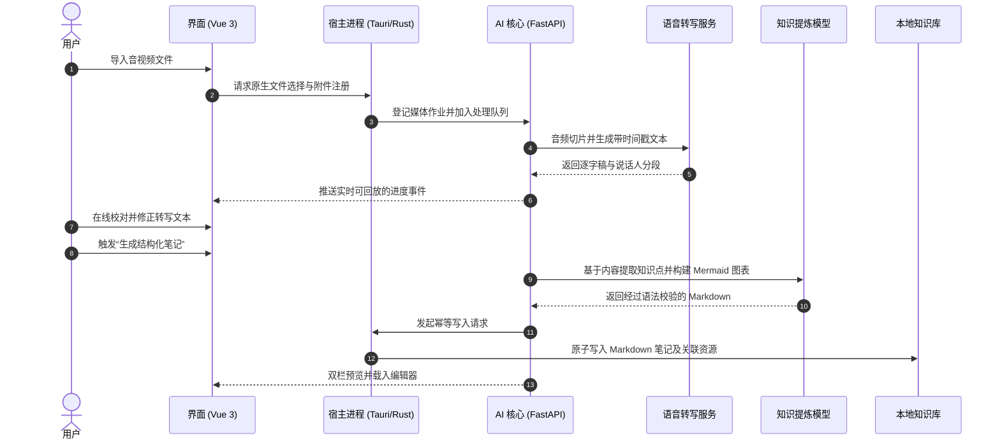
```mermaid
sequenceDiagram
    autonumber
    actor User as 用户
    participant UI as 界面 (Vue 3)
    participant Host as 宿主进程 (Tauri/Rust)
    participant Core as AI 核心 (FastAPI)
    participant ASR as 语音转写服务
    participant LLM as 知识提炼模型
    participant Vault as 本地知识库

    User->>UI: 导入音视频文件
    UI->>Host: 请求原生文件选择与附件注册
    Host->>Core: 登记媒体作业并加入处理队列
    Core->>ASR: 音频切片并生成带时间戳文本
    ASR-->>Core: 返回逐字稿与说话人分段
    Core-->>UI: 推送实时可回放的进度事件
    User->>UI: 在线校对并修正转写文本
    User->>UI: 触发“生成结构化笔记”
    Core->>LLM: 基于内容提取知识点并构建 Mermaid 图表
    LLM-->>Core: 返回经过语法校验的 Markdown
    Core->>Host: 发起幂等写入请求
    Host->>Vault: 原子写入 Markdown 笔记及关联资源
    Core-->>UI: 双栏预览并载入编辑器

```

### 2. 受控且可续跑的规划智能体

智能体执行轨迹会持续保存。工具权限可通过弹窗或运行卡片确认；达到 Token 或步数上限时，任务暂停并等待用户决定是否继续。保存的暂停点可在追加额度后续跑，不会重复已完成的工具操作：

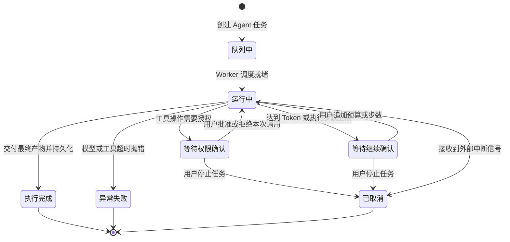
```mermaid
stateDiagram-v2
    [*] --> 队列中: 创建 Agent 任务
    队列中 --> 运行中: Worker 调度就绪
    运行中 --> 等待权限确认: 工具操作需要授权
    等待权限确认 --> 运行中: 用户批准或拒绝本次调用
    等待权限确认 --> 已取消: 用户停止任务
    运行中 --> 等待继续确认: 达到 Token 或执行步数上限
    等待继续确认 --> 运行中: 用户追加预算或步数
    等待继续确认 --> 已取消: 用户停止任务
    运行中 --> 执行完成: 交付最终产物并持久化
    运行中 --> 异常失败: 模型或工具超时抛错
    运行中 --> 已取消: 接收到外部中断信号
    执行完成 --> [*]
    异常失败 --> [*]
    已取消 --> [*]

```

### 3. 多智能体协作

在 AI 对话或智能体页面中，可以组合已有智能体并指定各自的任务与依赖。手动创建的智能体默认不设 Token 上限，也可自行设置；对话创建的智能体沿用当前所选模型并设置 Token 预算。用户确认协作计划后，系统并行调度就绪成员，将已完成的上游结果交给后续成员，最后汇总执行结果与产物：

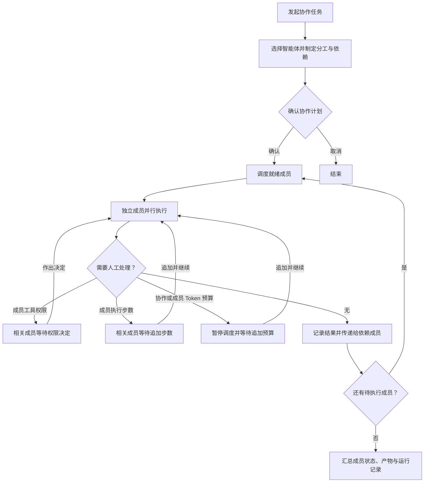
```mermaid
flowchart TD
    A["发起协作任务"] --> B["选择智能体并制定分工与依赖"]
    B --> C{"确认协作计划"}
    C -- 确认 --> D["调度就绪成员"]
    C -- 取消 --> X["结束"]
    D --> E["独立成员并行执行"]
    E --> F{"需要人工处理？"}
    F -- 成员工具权限 --> G["相关成员等待权限决定"]
    F -- 成员执行步数 --> H["相关成员等待追加步数"]
    F -- 协作或成员 Token 预算 --> I["暂停调度并等待追加预算"]
    G -- 作出决定 --> E
    H -- 追加并继续 --> E
    I -- 追加并继续 --> E
    F -- 无 --> J["记录结果并传递给依赖成员"]
    J --> K{"还有待执行成员？"}
    K -- 是 --> D
    K -- 否 --> L["汇总成员状态、产物与运行记录"]

```

---

### 4. 审核与恢复笔记修改

AI 新建、替换笔记或修改 Markdown 前，界面显示实际目标与内容差异。预览后文件若有变化，需要重新审核才能写入。笔记编辑器中的“修改历史”可查看成功写入的记录，并恢复至选中修改之前；恢复会保存为另一条历史记录，同时检查后续编辑是否造成版本冲突。

写入返回超时或历史未保存完成时，可从底栏“写入核对”检查当前知识库的待核对操作。系统使用写入前保存的实际计划内容与 Host 持久回执补齐历史，核对不会重新写入笔记。没有匹配回执、旧记录缺少证据时会保留不确定状态；后续人工编辑、移动或删除不会被当作 AI 的输出，也不会被恢复覆盖。

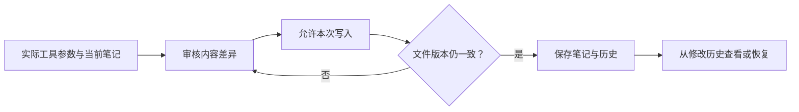
```mermaid
flowchart LR
    A[实际工具参数与当前笔记] --> B[审核内容差异]
    B --> C[允许本次写入]
    C --> D{文件版本仍一致？}
    D -- 是 --> E[保存笔记与历史]
    D -- 否 --> B
    E --> F[从修改历史查看或恢复]
```

### 5. 浏览知识库与比较评测结果

选择文件夹可查看导言和直接子笔记。点击底部状态栏中 AI Core 状态旁的“反向链接”，会弹窗显示当前文件的反向链接和知识库失效链接。点击引用可定位来源笔记或画布节点；移动文件前，可审核建议的引用改写。

`.canvas` 文件会打开可视化编辑器。点击“节点与属性”可显示或隐藏右侧节点栏，应用会记住选择。“更多画布操作（···）”提供复制、粘贴、删除、思维导图整理和“查看 JSON 源码”。思维导图整理只改变布局，并可撤销。

桌面版由顶部标题栏显示当前文件，保存按钮和 Markdown 编辑模式位于应用菜单右侧。扩展命令从“编辑 → 扩展命令”进入。

在已保存的会话中搜索，可以定位消息正文或可见操作。在 **Benchmark** 导入当前知识库的专属数据集，完成多次运行，再从“运行对比”选择基线与候选。直接比较要求两次运行均已完成且数据集内容哈希相同；无法计算的指标按缺失显示。应用重启后，运行记录与完整报告仍可读取。

对比将质量与耗时成本分别展示。“只看退步”包括 Agent 单项检查退步，即使两次运行总体都失败也能发现。展开用例可查看原始证据与配置差异；页面没有活动运行时，可点击“刷新”发现其他窗口完成的运行。

---

## 系统架构

OpenNexus 采用三层解耦架构，严格划分安全信任边界，兼顾本地计算性能与前端交互体验：

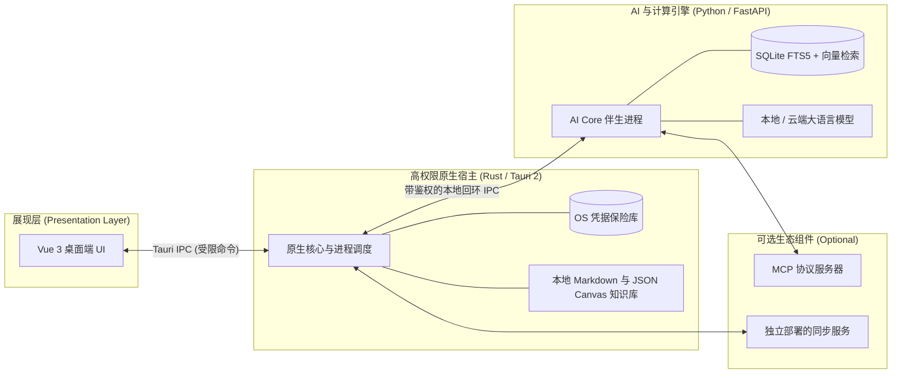
```mermaid
flowchart LR
    subgraph Frontend["展现层 (Presentation Layer)"]
        UI[Vue 3 桌面端 UI]
    end

    subgraph Host["高权限原生宿主 (Rust / Tauri 2)"]
        HOST[原生核心与进程调度]
        CRED[(OS 凭据保险库)]
        VAULT[本地 Markdown 与 JSON Canvas 知识库]
    end

    subgraph Core["AI 与计算引擎 (Python / FastAPI)"]
        CORE[AI Core 伴生进程]
        INDEX[(SQLite FTS5 + 向量检索)]
        LLM[本地 / 云端大语言模型]
    end

    subgraph External["可选生态组件 (Optional)"]
        MCP[MCP 协议服务器]
        SYNC[独立部署的同步服务]
    end

    UI <-->|"Tauri IPC (受限命令)"| HOST
    HOST <-->|"带鉴权的本地回环 IPC"| CORE
    HOST --- CRED
    HOST --- VAULT
    CORE --- INDEX
    CORE --- LLM
    CORE <--> MCP
    HOST <--> SYNC

```

### 职责与信任边界划分

| 层次划分 | 核心技术栈 | 主要职责范围 | 安全与隔离保障 |
| --- | --- | --- | --- |
| **视图层 (Frontend)** | Vue 3 + Tailwind | 工作区交互、双模式编辑器、Agent 状态看板、设置中心 | 无明文凭据存储权，无随意读写磁盘权 |
| **宿主层 (Host)** | Tauri 2 (Rust) | 系统级 API 调用、进程生命周期监控、密钥管理、原子文件写入 | 桌面安全中枢，路径严格限制在选定 Vault 内 |
| **计算层 (Core)** | FastAPI (Sidecar) | 混合检索调度、转写封装、Agent 循环、文档导出转换 | 仅监听本地回环地址，依赖宿主鉴权认证 |
| **数据层 (Vault)** | 本地文件 | Markdown 笔记与附件 | 用户自主选择的本地文件夹 |

OpenNexus 严格解耦了“用户可读数据”与“索引计算缓存”。可复用智能体配置、协作计划及审核记录保存在知识库作用域的 `agent_objects` 中；运行记录保存配置快照，暂停续跑点保存在 `agent_checkpoints` 中：

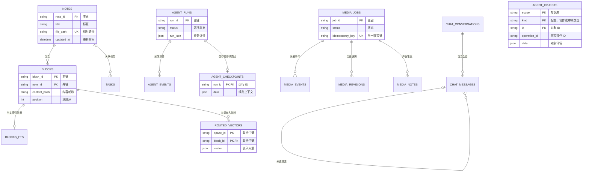
```mermaid
erDiagram
    NOTES ||--o{ BLOCKS : "包含"
    BLOCKS ||--o| BLOCKS_FTS : "全文索引映射"
    BLOCKS ||--o{ ROUTED_VECTORS : "向量嵌入映射"
    NOTES o|--o{ TASKS : "关联任务"
    AGENT_RUNS ||--o{ AGENT_EVENTS : "派发事件"
    AGENT_RUNS ||--o| AGENT_CHECKPOINTS : "保存暂停续跑点"
    MEDIA_JOBS ||--o{ MEDIA_EVENTS : "派发事件"
    MEDIA_JOBS ||--o{ MEDIA_REVISIONS : "历史快照"
    MEDIA_JOBS ||--o{ MEDIA_NOTES : "产出笔记"
    CHAT_CONVERSATIONS ||--o{ CHAT_MESSAGES : "包含会话"
    CHAT_MESSAGES o|--o{ CHAT_MESSAGES : "分支溯源"

    NOTES {
        string note_id PK "主键"
        string title "标题"
        string file_path UK "相对路径"
        datetime updated_at "更新时间"
    }
    BLOCKS {
        string block_id PK "主键"
        string note_id FK "外键"
        string content_hash "内容哈希"
        int position "块顺序"
    }
    ROUTED_VECTORS {
        string space_id PK "联合主键"
        string block_id PK,FK "联合主键"
        json vector "嵌入向量"
    }
    AGENT_RUNS {
        string run_id PK "主键"
        string status "运行状态"
        json run_json "任务详情"
    }
    AGENT_OBJECTS {
        string scope PK "知识库"
        string kind PK "配置、协作或审核类型"
        string id PK "对象 ID"
        string operation_id "幂等操作 ID"
        json data "对象详情"
    }
    AGENT_CHECKPOINTS {
        string run_id PK,FK "运行 ID"
        json data "续跑上下文"
    }
    MEDIA_JOBS {
        string job_id PK "主键"
        string status "状态"
        string idempotency_key UK "唯一幂等键"
    }

```

---

## 生态项目

为确保单机版本的纯粹性并降低维护依赖，网络同步与公共服务拆分至独立代码库维护：

| 项目仓库 | 职责定位 | 技术实现 |
| --- | --- | --- |
| **[OpenNexus](https://github.com/KiriAky107/OpenNexus)** | 桌面主程序与内置 AI 核心引擎 | Tauri 2, Rust, Vue 3, FastAPI |
| **[Sync-for-OpenNexus](https://github.com/KiriAky107/Sync-for-OpenNexus)** | 可选的自建端到端加密同步后端 | Rust / Go, PostgreSQL, S3 |
| **[Community-for-OpenNexus](https://github.com/KiriAky107/Community-for-OpenNexus)** | 官方与社区插件、技能、预设模板中心 | 静态托管服务 / 包注册表原型 |

---

## 本地开发

### 环境基线要求

| 运行时环境 | 最低支持版本 |
| --- | --- |
| **操作系统** | Windows 10/11 x64 |
| **Node.js** | `>= 22.0.0`（通过 corepack 启用 `pnpm 10.28.0`） |
| **Python** | `>= 3.11`（推荐通过 [`uv`](https://github.com/astral-sh/uv) 管理） |
| **Rust** | 最新稳定版 Toolchain（带 `x86_64-pc-windows-msvc` target） |
| **WebView2** | 安装程序检测并按需安装 Microsoft Edge WebView2 Runtime（需联网）；应用自带 SDK Loader DLL |

### 1. 环境初始化

```powershell
# 克隆代码仓库
git clone https://github.com/KiriAky107/OpenNexus.git
cd OpenNexus

# 安装 Python AI 核心依赖
cd backend
uv sync --frozen

# 安装前端与桌面框架依赖
cd ..\frontend
corepack enable
corepack prepare pnpm@10.28.0 --activate
pnpm install --frozen-lockfile

```

### 2. 启动开发服务器

```powershell
# 终端 1：从仓库根目录启动 AI Core 伴生服务
cd backend
uv run python scripts/dev-server.py

# 终端 2：从仓库根目录启动前端 Web 实时预览
cd frontend
pnpm dev

```

> **联调测试**：若要调试原生桌面交互（如原生文件弹窗、系统密钥链等），请在 `frontend/` 目录下执行 `pnpm tauri dev`（需确保后端产物已正确放置于预设 sidecar 目录）。

### 3. 代码质量与测试校验

在提交 PR 之前，请运行完整的静态检查与自动化测试：

```powershell
# 后端测试
cd backend
uv run pytest

# 前端类型检查与构建测试
cd ..\frontend
pnpm type-check
pnpm test
pnpm build

# Rust 宿主端代码格式与 Lint 检查
cd src-tauri
cargo fmt --check
cargo test --all-targets --features desktop
cargo clippy --all-targets --features desktop -- -D warnings

```

---

## 打包发布

从仓库根目录依次构建 AI Core 与 Windows NSIS 安装程序：

```powershell
uv run --directory backend --group packaging python ../scripts/build-core.py
cd frontend
pnpm desktop:build

```

构建完成的安装包将输出至 `frontend/src-tauri/target/release/bundle/nsis/`。[0.5.9-beta2 Release](https://github.com/KiriAky107/OpenNexus/releases/tag/v0.5.9-beta2) 同时提供固定发布提交的源码压缩包与 SHA-256 清单。

Windows 安装包会在 `OpenNexus.exe` 同目录包含匹配架构、带微软签名的 `WebView2Loader.dll`，打包前从依赖锁定的 WebView2 SDK 准备。WebView2 Runtime 安装程序不会替应用提供这个 DLL。内嵌引导程序会在需要时安装 Runtime，仍需联网。解压安装包后可运行 `python scripts/verify-windows-loader.py <安装包解压目录>`，检查主程序与 Loader 架构及 SDK 哈希，避免构建机上已有的 SDK 掩盖漏打包问题。

[GitHub Actions CI](https://github.com/KiriAky107/OpenNexus/actions/workflows/ci.yml) 在 `main` 推送和 Pull Request 时执行文档、后端、前端和 Rust 检查，包括 Windows 文件监听、重命名身份与同步回归。手动触发的 [Windows 打包工作流](https://github.com/KiriAky107/OpenNexus/actions/workflows/windows-rc.yml) 使用同一基础打包配置构建 MSVC 安装包并校验解包后的实际内容。普通未签名构建无需签名秘密；选择签名构建时需配置 Windows 证书和 Core 签名密钥。产物和验证报告可从各次运行页面下载。

---

## 安全与隐私准则

* **本地优先计算**：笔记内容全程保存在本地。除非显式配置并启用了第三方云端模型或同步扩展，否则绝无后台上传行为。
* **敏感凭证防泄漏**：模型提供商 API 密钥交由操作系统凭据安全区保管，杜绝存放在前端 `localStorage` 或代码仓库中。
* **受限沙箱路径**：原生宿主对所有传入的文件操作进行越界校验（Directory Traversal 防御），拒绝访问指定 Vault 以外的任何磁盘路径。
* **安全漏洞汇报**：如发现可利用的安全缺陷，请勿直接公开提 Issue，请通过 [GitHub 私密漏洞上报渠道](https://github.com/KiriAky107/OpenNexus/security/advisories/new) 提交。

---

## 参与贡献

我们欢迎社区各种形式的代码贡献与反馈！为了保证项目的工程演进速度，请遵循以下规范：

1. **Commit 规范**：使用 [Conventional Commits](https://www.conventionalcommits.org/zh-hans) 提交信息格式：
* `feat(agent): 新增工具调用的自动重试机制`
* `fix(editor): 修复表格编辑模式下的光标跳跃异常`
* `test(media): 补充音视频损坏数据块的容错回归测试`


2. **变更原则**：保持单个 PR 职责单一（Atomic Change）。包含破坏性改动或界面变动时，请附带测试用例或前后效果对比图。
3. **文档同步**：修改涉密协议、配置项或通用交互时，请同步更新 `README.md` 与 `README.zh-CN.md`。

详见 [贡献指南](CONTRIBUTING.md) 与 [行为准则](CODE_OF_CONDUCT.md)。

---

## 开源协议

OpenNexus 核心代码基于 [MIT License](LICENSE) 授权开源。所引用的第三方库、字体、分发运行时以及大语言模型权重遵循其各自独立的开源协议与版权声明。
