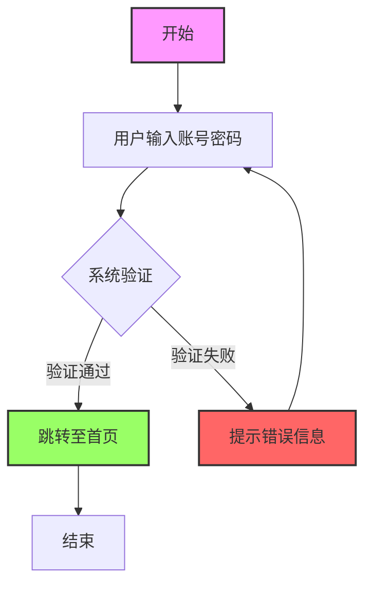
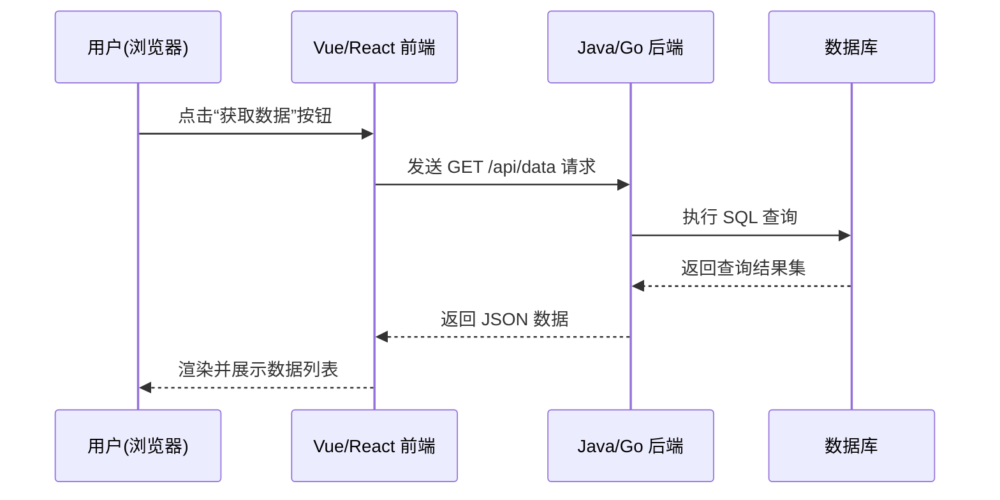

 

```mermaid
graph TD
    A[开始] --> B[用户输入账号密码]
    B --> C{系统验证}
    C -- 验证通过 --> D[跳转至首页]
    C -- 验证失败 --> E[提示错误信息]
    E --> B
    D --> F[结束]
    
    style A fill:#f9f,stroke:#333,stroke-width:2px
    style D fill:#9f6,stroke:#333,stroke-width:2px
    style E fill:#f66,stroke:#333,stroke-width:2px
```

```mermaid
sequenceDiagram
    participant 用户 as 用户(浏览器)
    participant 前端 as Vue/React 前端
    participant 后端 as Java/Go 后端
    participant DB as 数据库

    用户 ->> 前端: 点击“获取数据”按钮
    前端 ->> 后端: 发送 GET /api/data 请求
    后端 ->> DB: 执行 SQL 查询
    DB -->> 后端: 返回查询结果集
    后端 -->> 前端: 返回 JSON 数据
    前端 -->> 用户: 渲染并展示数据列表
```

