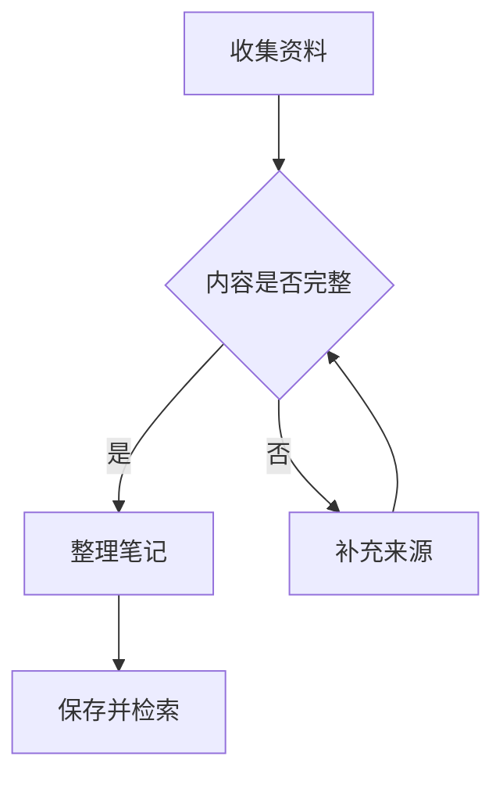
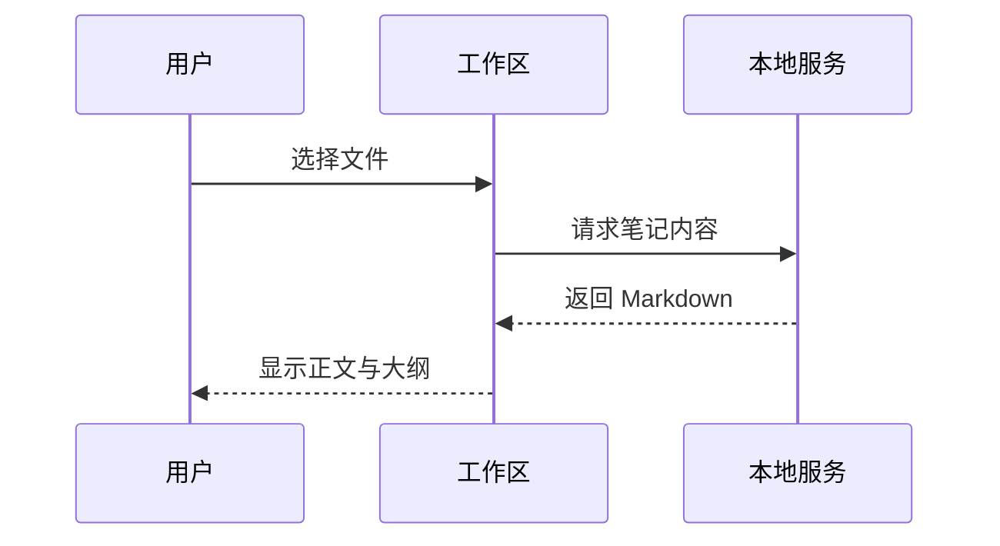
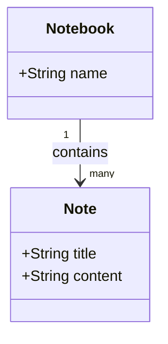
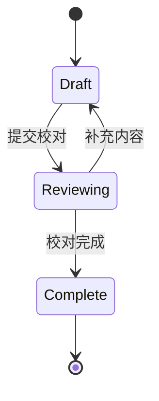
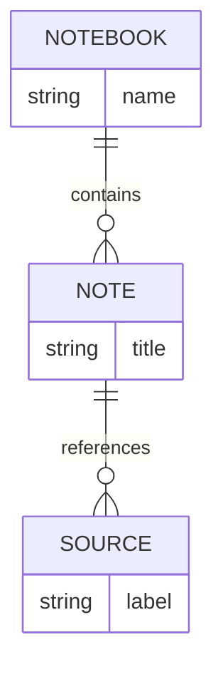
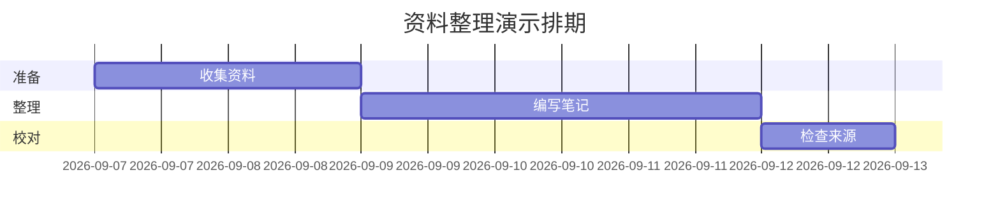

# Mermaid 图表集

以下图表没有指定节点颜色，便于查看默认配色如何跟随主题。把鼠标移到预览区域可查看缩放工具，并进入大图查看。

## 流程图：资料整理

```mermaid
flowchart TD
    A[收集资料] --> B{内容是否完整}
    B -->|是| C[整理笔记]
    B -->|否| D[补充来源]
    D --> B
    C --> E[保存并检索]
```

## 时序图：打开笔记

```mermaid
sequenceDiagram
    participant U as 用户
    participant W as 工作区
    participant S as 本地服务
    U->>W: 选择文件
    W->>S: 请求笔记内容
    S-->>W: 返回 Markdown
    W-->>U: 显示正文与大纲
```

## 类图：演示数据关系

```mermaid
classDiagram
    class Notebook {
        +String name
    }
    class Note {
        +String title
        +String content
    }
    Notebook "1" --> "many" Note : contains
```

## 状态图：一份草稿

```mermaid
stateDiagram-v2
    [*] --> Draft
    Draft --> Reviewing: 提交校对
    Reviewing --> Draft: 补充内容
    Reviewing --> Complete: 校对完成
    Complete --> [*]
```

## ER 图：虚构资料目录

```mermaid
erDiagram
    NOTEBOOK ||--o{ NOTE : contains
    NOTE ||--o{ SOURCE : references
    NOTEBOOK {
        string name
    }
    NOTE {
        string title
    }
    SOURCE {
        string label
    }
```

## 甘特图：演示排期

```mermaid
gantt
    title 资料整理演示排期
    dateFormat YYYY-MM-DD
    section 准备
    收集资料 :a, 2026-09-07, 2d
    section 整理
    编写笔记 :b, after a, 3d
    section 校对
    检查来源 :c, after b, 1d
```

这些日期仅用于显示图表，不会创建真实任务或提醒。
